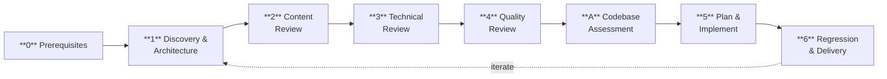

# Reviewing Codebase

**Holistic** review of skills, code, and infrastructure across a portfolio of repos. Treats the entire portfolio as a connected system — the most dangerous bugs live at the seams: where one skill's output becomes another's input, where a skill describes code that has since changed, or where two repos encode the same convention differently. Cross-review is not just skill-vs-code — it's repo-vs-repo, skill-vs-skill, and code-vs-code across the full portfolio.

## Mission: Re-Raise Quality, Don't Just Report (Non-Negotiable)

AI-assisted change accretes architectural entropy — fast-but-shallow edits leave the repo a little worse each pass: god-modules grow, dependency guardrails go stale or blind, smells get layered over. This skill's job is to **counteract that drift, not narrate it**. Every review pass actively re-raises quality: critically assess the architectural changes since last review, and *improve them in the same session* when a fix is concrete (per Rule 9 — implement, don't postpone). A review that produces a findings list but leaves the architecture as-found has failed its mission. The deliverable is a measurably-better codebase, not a report. Reserve "file it" only for changes too large or design-ambiguous to land safely this session — and even then, fix the safe blast-radius now and recommend a concrete design for the rest.

## Dependencies

Standalone. No hard dependencies on other skills.

**Recommended companions (load during Phase 0 if applicable):**

- **`ac-python`** — When the reviewed repo contains Python scripts or tests, load for its integration-first testing philosophy and code style guidelines.
- **`ac-django`** — When the reviewed repo uses Django (check for `django` in dependencies or `manage.py`), load for Django-specific patterns and conventions.

**Companion loading is not optional when the condition matches.** If the reviewed code is Python, load `ac-python`. If it uses Django, load `ac-django`. Skipping companions leads to incomplete reviews.

## Configuration: `~/.ac-reviewing-codebase`

On startup, load `~/.ac-reviewing-codebase` (hardcoded path) if it exists. Shell-sourceable config file with uppercase variable names.

```bash
# Root the repo scan walks. Every repo path below is relative to it.
WORKSPACE_DIR="~/workspace"

# Regex matched against resolved skill paths.
# Skills whose real path matches are owned by the user and can be modified.
MAINTAINED_SKILLS="my-repo/|other-repo/internal/(my-skill/)"

# Regex matched against repo paths relative to WORKSPACE_DIR.
# All git repos under WORKSPACE_DIR whose relative path matches are managed.
MANAGED_REPOS="<org>/(repo-a|repo-b|repo-c)$"

# Boilerplate -> dependent repos mapping.
# Format: boilerplate_name:dep1,dep2;boilerplate_name:dep1,dep2
BOILERPLATE_MAP="<boilerplate-repo>:<dep-repo-1>,<dep-repo-2>"

# PR-sweep policy per repo (consumed by the sweeping-prs skill).
# Format: repo_pattern:policy;repo_pattern:policy
# Policies: bulk-update (default — refresh PR from main, do not merge)
#           serial-merge (refresh, wait for CI green, squash-merge, then next PR)
SWEEP_POLICY="<owned-org>/(repo-a|repo-b):serial-merge"
```

| Variable | Purpose | Fallback when missing |
|----------|---------|----------------------|
| `WORKSPACE_DIR` | Root directory the repo scan walks | `~/workspace` |
| `MAINTAINED_SKILLS` | Regex for ownership check — skills matching this can be modified freely | Ask user before modifying any skill |
| `MANAGED_REPOS` | Regex to discover repos under `WORKSPACE_DIR` for status/audit/squash | Ask user which repos to manage |
| `BOILERPLATE_MAP` | Maps boilerplate repos to their dependents for backport workflow | No backporting |
| `SWEEP_POLICY` | Per-repo policy for the `sweeping-prs` skill — `bulk-update` only refreshes the PR from `main`; `serial-merge` also squash-merges before moving to the next PR (avoids conflict cascades on owned repos) | All repos default to `bulk-update` (refresh-only) |

This file is the only configuration the CLI reads. Earlier revisions pointed at a
second, TOML-format workspace config as the source of `workspace_dir`; no code
ever read it, so a reader who set the workspace root there got the `~/workspace`
fallback and a silently wrong repo list.

**This file may be shared with a lifecycle tool** (which references it for workspace and ownership config). Users of such tools can generate it during setup. Otherwise, create it manually.

## External References

- [Anthropic Skill Authoring Best Practices](https://platform.claude.com/docs/en/agents-and-tools/agent-skills/best-practices)
- [Agent Skills Overview](https://platform.claude.com/docs/en/agents-and-tools/agent-skills/overview)

## Deterministic CLI

Single entry point at [`scripts/cli.py`](scripts/cli.py).

```bash
# FIRST action of every review — render the enforced completion checklist
uv run ac-reviewing-codebase/scripts/cli.py review-checklist [--out PATH]

# LAST action of every review — gate: exits non-zero until the review is complete
uv run ac-reviewing-codebase/scripts/cli.py review-verify [CHECKLIST]

# Validate SKILL.md frontmatter in a skills repo
uv run ac-reviewing-codebase/scripts/cli.py check [--root PATH]

# Show delivery status across all managed repos
uv run ac-reviewing-codebase/scripts/cli.py status [--repo NAME] [--verbose]

# Inventory config files and health checks
uv run ac-reviewing-codebase/scripts/cli.py config

# Run deterministic codebase metrics → JSON
uv run ac-reviewing-codebase/scripts/cli.py assess [--root PATH] [--json]
```

In this repo's pre-commit hook, the `check` command runs automatically. When reviewing another repo interactively, call explicitly before the deeper review.

## Completion Is Enforced, Not Remembered (Non-Negotiable)

This review is ~40 mandatory items spread over 1,500 lines of reference prose. The
observed failure — repeatedly, across sessions — is that an agent runs Phase 0, finds
real bugs, ships them, and reports "review complete" having covered a fraction of the
scope. Nothing structurally distinguished a finished review from an abandoned one, and
the earlier prose rule against it (Rule 12) did not hold, because a rule that asks the
agent to remember 40 things is the same class of mechanism that failed.

So completion is executable:

1. **Begin** every review by running `review-checklist`. It renders
   [`references/review-manifest.md`](references/review-manifest.md) — the single source
   of truth for scope — into a working checklist.
2. **Tick each item as you complete it, with evidence** naming what you actually ran or
   read. A tick costs one keystroke and looks identical to real work in a diff; the
   evidence line is what makes the difference visible.
3. **You may not report the review complete until `review-verify` exits 0.** It fails on
   any unticked non-negotiable, and on any tick with an empty `evidence:`.

An item that genuinely does not apply is ticked with `evidence: n/a — <reason>`.
Declaring something inapplicable is a judgment that leaves a record; silently skipping
it is exactly what this gate exists to catch.

If the review is genuinely too large for one session, say so and report the checklist
state — a partial review honestly reported is fine. A partial review reported as
complete is not.

**For the person who asked for the review.** No instruction can force an agent to run
a command, so the gate's real power is that it makes a completion claim *falsifiable*
by you, in one command:

```bash
uv run ac-reviewing-codebase/scripts/cli.py review-verify .review-checklist.md
```

Non-zero means the review is not done, whatever the summary said. If the checklist does
not exist at all, the review was never scoped against this manifest — which is itself
the answer. Ask for the checklist alongside the findings; it is the deliverable that
says how much of the scope was actually covered.

## Quality Principles

Read [`references/quality-principles.md`](references/quality-principles.md) before starting any review. Defines the 8 principles every skill and codebase is evaluated against: Reliability, Robustness, Platform Independence, Automation & Escalation, Agent Agnosticism, Self-Improvement, Paradigm Fitness, and Skill vs Model Balance.

## Rules

1. **Mechanical evidence-gathering: tight main-thread scans by default; parallel sub-agent dispatch is an escalation, not the first move.** Per-repo mechanical signals (`git status`, `git log @{u}..HEAD`, `git stash list`, lint, format-check, test summary, TODO/noqa counts) produce **small, easily capped** output — counts, `tail -N`, one-line summaries — so the context-budget argument for fanning out is weak *for mechanical work specifically*. Default to running these directly in the main thread with aggressively capped output, one repo at a time. This is faster and more reliable than dispatch (observed: 4/4 parallel Explore agents failed an audit even with every counter-measure applied — thrash, hallucinated "TEXT ONLY" constraints from compaction summaries, outright refusal).

   **Escalate to parallel sub-agents only when** the work is judgment-heavy *and* independent (e.g. reading many full files per repo for architectural assessment), or the portfolio is so large that even capped per-repo scans would exhaust context. When you do dispatch:
   - **One repo per agent.** Never combine two repos in one prompt.
   - **Prescribe the exact commands**, not a set of dimensions. Instead of "audit hygiene" write "run `git status --short`, `git log --oneline @{u}..HEAD`, `git stash list` and report verbatim".
   - **Cap the report size** (≤300 words) and forbid summarization of findings — the agent returns raw evidence, you synthesize in main thread.
   - **After ONE failed re-dispatch**, fall back to main-thread scans for that repo. Do not keep redispatching.

   Either way, **judgment-heavy synthesis** (architectural assessment, cross-review at seams, deciding what to consolidate, implementation) stays in the main conversation. The anti-pattern this rule guards against is *serializing slow full-file reads* across many repos in the main thread — not running fast capped mechanical scans there, which is the preferred path.
2. **Work in worktrees** on the source repos (git-tracked), never on main clones or symlink targets under the agent runtime's skills directory. Create a review branch and worktree per repo before making edits.
3. **Be thorough, not fast.** Resist the urge to rush to completion. Each phase exists for a reason.
4. **Ask when ambiguous (Non-Negotiable).** When you encounter an unclear design decision, ambiguous scope, or a choice with multiple valid options — **stop and ask the user**. In checker mode, mark ambiguous items as errors and `FAIL`. **Carve-out — routine repo hygiene is not this kind of ambiguity.** Stale worktrees, branches ahead of the default branch, leftover stashes, merged-PR cleanup: investigate (is the content already merged? unique unfinished work? superseded?) and *act* on the conclusion. Do not present a drop/keep/inspect menu for housekeeping. Only escalate to the user when the content is genuinely ambiguous *or* the action is destructive **and** irreversible (e.g. deleting a branch with unmerged, non-superseded work).
5. **Generic vocabulary only.** Use terms like "project-specific skills", "generic/framework skills", "lifecycle skills" — never hardcode actual skill names in this file.
6. **Consolidate aggressively.** Critical operational knowledge gets ignored when buried in project-specific playbooks. The reviewer must actively hunt for buried knowledge and surface it.
7. **Respect content publication status.** When `draft: false`, content is published and **must not be modified** — flag issues but do not edit.
8. **This skill is meta — it must remain agnostic.** No specific skill names, project names, repo structures, or tool stacks. Works for any portfolio.
9. **Implement, don't postpone (Non-Negotiable).** When review identifies concrete improvements, implement them in the same session. TODO comments are postponement.
10. **Factorize aggressively.** Duplicated logic across scripts, repos, or skills is a finding. Extract to a shared module, tool, or reference file. When unsure whether duplication is intentional — **ask the user**.
11. **Documentation must be current or auto-generated.** Check that docs (README, BLUEPRINT, generated API docs) are up to date with the code. If manually maintained, flag drift. If auto-generated, verify the generation hook exists in pre-commit or CI. Missing auto-generation for documentation that should be generated is a finding.
12. **Phase 0 fixes are NOT the review, and the checklist is how you prove it (Non-Negotiable).** Phase 0 prerequisite checks routinely surface quick-win fixups — a stale ref in a generator script, a shim bug, a missing dep declaration. Shipping those is encouraging, but it is not the review. This rule used to end with "before declaring the review done, explicitly list every repo in scope and confirm each has been through Phases 1–4", and **that did not work**: it asked the agent to remember, which is the same mechanism that fails. Completion is now gated by `review-verify` (see § "Completion Is Enforced, Not Remembered"). Run `review-checklist` first, tick items with evidence as you go, and do not report the review complete until the gate exits 0. A review that touched 2 of 8 in-scope repos is 25% complete, not done — and the checklist will say so out loud.
13. **Behavioral-eval coverage is a SUGGESTION, never an enforcement.** Deterministic tests grade what code *does*; they cannot grade what a skill instructs an agent to do or whether non-deterministic, AI-evaluated behavior holds at runtime. When a reviewed skill encodes a load-bearing rule, or runtime behavior depends on what an LLM agent says/invokes, **suggest** behavioral-eval coverage (per-skill embedded evals and/or upper-level integration AI evals). This is **conditional**: suggest the cheapest layer that reaches the behavior (code-enforceable → deterministic test; LLM-output-only → transcript scenario), suggest it **partially** (the skill's load-bearing rules, not every line), and **never suggest it when the repo already has its own eval/behavioral-test mechanism** — align with that one instead of layering a second. It is a finding the user may decline, not a gate. See [`references/ai-eval-review.md`](references/ai-eval-review.md) for the mechanism so every such finding names a concrete shape.
14. **Verify a flagged issue before acting on it.** A smell spotted in passing — an incidental claim from a sub-scan, a pattern that "looks wrong" — is a lead, not a confirmed finding. Reproduce it against the actual code (run the command, trace the path) before blocking on it or recording it as a durable finding. An unverified claim propagated as fact wastes the author's time and erodes trust in the review.
15. **Independent eyes catch more than the author's.** A review carries most of its value when the reviewer is not the author of the change — a self-review is blind to the very assumptions that produced the bug. When you can, route the review to a different person, or a separate agent run, than the one that wrote the code. This is a principle about review efficacy, not a workflow mandate — it holds whether the review is human or automated.

---

## Review Phases



## Phase 0 — Prerequisites

**0. Render the checklist — do this before anything else.** Run
`cli.py review-checklist`. Everything below, and every phase after it, is an item on
that checklist; `review-verify` will refuse to pass until each is ticked with evidence.
Starting the review without it is how a review ends up 25% done and reported as
finished.

Then:

1. **Verify git-tracked source repos.** For each repo in scope, confirm skill directories are git-tracked sources, not symlink targets. When the user's cwd is a parent of multiple skill repos (not itself a repo), verify each child repo individually.
2. **Symlink health check.** Scan agent skill directories for **maintained skills** (matching `MAINTAINED_SKILLS` regex) that are managed installs instead of live clone symlinks. Report stale installs.
3. **Check for unstaged changes & main-clone hygiene.** Run `git status` in each managed repo. If there are uncommitted changes, **commit them before starting** — keeps review changes cleanly separated. A main clone parked on a feature branch with uncommitted edits is a worktree-rule violation: rescue the dirty work onto a fresh branch + worktree, restore the main clone to its default branch, then continue.

   **Stash & stale-branch triage (Non-Negotiable).** For every leftover stash or branch ahead of the default branch, before deciding apply-vs-drop **verify the content is not already present elsewhere in the portfolio** — a CLI command, a sibling skill or reference file, or an already-merged (often squash-merged) PR. If it is, the content is not unique: apply only the genuinely-new delta and reconcile against the canonical home rather than creating a divergent third copy; drop the rest. Detecting "is this branch already merged?" by commit count or `git diff` content-equality is **unreliable under squash-merge workflows** (squash creates a new SHA and the default branch moves on) — use **PR merge-state** as the authoritative signal, or a project-provided worktree-cleanup command if one exists, rather than hand-rolling heuristics.
4. **Open-PR sweep (Non-Negotiable).** The review must run against the latest state — outstanding PRs that are about to land would produce stale findings and force a re-review.
   - **Preferred path:** if the session offers a dedicated PR-sweep skill from a lifecycle tool, invoke it and proceed once it returns. Repos with `serial-merge` declared in `SWEEP_POLICY` (see § Configuration) will fully drain before the sweep returns; repos on `bulk-update` will only be refreshed against `main`.
   - **If unavailable:** ask the user whether they have one to install. If they decline, sweep manually by asking the user the few questions needed to do it correctly (which repos, which PRs to include/exclude, conflict-resolution preference, whether to wait for CI, **whether to also merge each PR after CI greens for fully-owned repos**), then walk each open PR — update from base, push, monitor CI, fix root causes (never `--no-verify`), and (for repos the user wants drained) squash-merge before the next PR — and surface any skipped PR in the final report.
5. **Determine review scope.** Use `MAINTAINED_SKILLS` from config to discover all repos and skills in scope. List discovered skills grouped by repo and ask the user to confirm or narrow.
6. **Discover agent memory and config files dynamically.** Scan platform-specific locations (e.g., `~/.claude/projects/*/memory/`, `~/.codex/`, `~/.cursor/`) for memory files. Check for repo-level agent config (`AGENTS.md`, `.cursorrules`, or similar) in each project root. Include all discovered files in the asset inventory for cross-review.
7. **Read all selected skills fully.** Load every `SKILL.md`, every reference, every script, every hook config. Do not skim.

---

## Phase 1 — Discovery & Architecture

**Review skills in context.** When reviewing multiple skills, treat them as a connected system. When reviewing a single skill, still check its connections.

### 1.1–1.5: Skill & Code Architecture

- **1.1 Dependency graph.** Build the dependency graph between skills and their neighbors. Check coupling direction: generic skills must NOT import project-specific skills.
- **1.2 Architecture assessment.** Is the skill/code decomposition optimal? Merges, splits, restructuring? Medium assessment: >60% deterministic procedures → toolification candidate.
- **1.3 Dependency documentation.** Every skill must declare dependencies or state "Standalone."
- **1.4 Managed assets inventory.** Build an inventory of external assets (configs, repos, memory files, hooks). Classify: owned, referenced, instructed.
- **1.5 Cross-skill/cross-module consistency.** Grep for shared patterns across all skills and code repos. Same concept with different names in different places = stale.

### 1.6: Cross-Review — Holistic Consistency (Non-Negotiable)

**This is the key differentiator of this skill.** The review is holistic — it crosses ALL boundaries: skill-vs-code, skill-vs-skill, code-vs-code, and repo-vs-repo. Every artifact in the portfolio is checked against every other artifact it interacts with.

**Skill ↔ Code:**

1. **Skill → Code verification.** For every skill that references CLI commands, API patterns, file paths, or code conventions — verify those references against the actual codebase. Run the commands. Check the paths exist. If a skill says "run `tool setup`", verify that command exists and works as described.
2. **Code → Skill verification.** For code patterns that should be governed by skills (testing conventions, commit workflows, deployment procedures) — verify the skill accurately describes current behavior. If the code has changed since the skill was written, one of them is stale.

**Repo ↔ Repo:**

3. **Cross-repo convention alignment.** When multiple repos encode the same convention (branch naming, commit message format, test structure, CI pipeline steps), verify they agree. Divergence between repos is the most common source of "it works in repo A but breaks in repo B."
4. **Shared dependency contracts.** When repos share libraries, APIs, or data formats — verify the producer and consumer agree on the contract. Check version compatibility across repos.

**Boilerplate Factorization (Non-Negotiable):**

5. **Extract common patterns to boilerplate.** When 2+ repos contain the same config, script, CI pipeline, or project structure — this is a boilerplate extraction candidate. The shared pattern should live in a boilerplate repo and be propagated to dependents, not copy-pasted. Flag every instance and propose extraction.
6. **Align existing copies.** When boilerplate repos already exist, verify that dependent repos stay aligned. Drift between a boilerplate and its dependents is a finding — either backport the change or document why the dependent diverges. Unjustified divergence = stale copy.
7. **Maximize similarity across components.** Even when full factorization into a boilerplate isn't practical, repos that serve similar roles (e.g., multiple microservices, multiple skill repos) should be as similar as possible: same directory structure, same CI config shape, same tooling versions, same pre-commit hooks. Gratuitous differences increase cognitive load and hide real differences that matter.

**Seam Verification:**

8. **Contract verification at seams.** Where one skill produces output consumed by another (or by code), verify the producer's output format matches the consumer's expected input. Trace the full lifecycle at every handoff point.
9. **Naming consistency.** Grep for key terms (branch names, CLI commands, function names, status labels) across ALL skills AND code repos in scope. Same concept with different names = stale reference.

**Override & Routing Verification (Non-Negotiable):**

10. **Method-override contract verification.** For overlay/plugin architectures, list every method the overlay defines on composed classes (`OverlayMetadata`, `OverlayConfig`, etc.) and verify each one exists on the corresponding base class with the same name. A method that exists on the subclass but not the base class is either a new extension (should be declared in the base) or a broken override (silently dead code). Concrete check: `grep -n 'def ' overlay/*.py | grep -v '__'` → for each, verify the method name appears in the base class. Bulk renames (e.g., MR→PR) are the #1 cause of silent override breakage.
11. **Routing completeness after skill extraction.** For every skill in `skills/`, verify it has a path to be loaded: (a) it appears in at least one keyword map or routing table in the Python code (`_AGENT_TASK_KEYWORDS`, `_PHASE_TO_SKILL`), (b) an agent definition in `agents/*.md` lists it in its `skills:` frontmatter, (c) its trigger keywords don't collide with another skill's keywords without a clear priority winner. A skill with no routing path is unreachable. This check is especially critical after a skill is extracted from another — the routing infrastructure must be updated in the same change.

### 1.7: Silenced Quality Detection (Non-Negotiable)

**Hunt for manually suppressed code quality signals** — lowered coverage thresholds, `# noqa` suppressions, excluded files from pre-commit, relaxed per-file-ignores, missing hooks, companion skill violations. See [`references/review-phases.md`](references/review-phases.md) § 3.14 for the full checklist.

---

## Phases 2–4 — Content, Technical & Quality Review

Read [`references/review-phases.md`](references/review-phases.md) for the full checklists. Summary:

- **Phase 2 — Content Review:** Duplication & diverged copies, conciseness, self-sufficiency & knowledge placement, cross-repo memory scan, skill ↔ repo config boundary, information boundaries, knowledge consolidation, cross-references, no hardcoded paths, guardrail classification, multi-layer overlap.
- **Phase 3 — Technical Review:** Script language & conventions, pre-commit hooks, cross-repo infrastructure, script verification, hook scripts, code quality & simplification, **promotion of plugin/overlay platform wrappers to core backends**, security review, CLI vs MCP preference, single CLI entrypoint, sub-agent safety, test coverage, **behavioral-eval coverage for non-deterministic behavior (suggest, don't enforce — see Rule 13 and [`references/ai-eval-review.md`](references/ai-eval-review.md))**, upstream-first, **CLI structure & naming coherence** (consistent commands, arguments, exit codes, file hierarchy across all repos), **documentation freshness**, **factorization**, **silenced quality signals**.
- **Phase 4 — Quality Review:** Production-grade standard, attribution, agent agnosticism, attention to detail, formatting consistency, skill authoring best practices.

---

## Phase A — Codebase Assessment

Deterministic metrics + LLM architectural judgment. Read [`references/codebase-assessment.md`](references/codebase-assessment.md) for the full methodology.

**Quick summary:**

1. **Run deterministic metrics** via `scripts/cli.py assess`. Collects: ruff violations, test coverage gaps, cyclomatic complexity, TODO/FIXME counts, dependency staleness. Plus cheap **file-hierarchy signals** (root-level file count, files-per-directory, max tree depth, oversized modules, directories mixing unrelated file types) computed manually over `git ls-files` — see [`references/codebase-assessment.md`](references/codebase-assessment.md) Part 1.
2. **Architectural judgment** (LLM-driven): naming consistency, separation of concerns, abstraction quality, module boundaries, coupling analysis, **file hierarchy & module organization** (cohesion/scoping, misplaced files, root clutter, god-modules, `__init__` surface, test-mirrors-source — emits concrete `from -> to` moves; see [`references/codebase-assessment.md`](references/codebase-assessment.md) § 2h).
3. **Output:** Three scores (cleanliness, maintainability, architecture, each 1–10) + ranked improvement list with impact/effort/affected files.
4. **Action items are primary, scores are secondary.** Nobody acts on "architecture is a 6." They act on "extract payment logic from the view layer (high impact, medium effort, 4 files)."

---

## Phase 5 — Plan & Implement

### 5.1 Change Plan

Compile all findings from Phases 1–4 + A into a structured change plan. Group by repo and type.

### 5.2 Progressive Clarification (Non-Negotiable)

Present non-ambiguous items as "will do." For ambiguous items, ask **one question at a time**. Never dump a wall of questions.

### 5.3 Implementation

- **Ownership check before each file edit (Non-Negotiable):** Resolve real path and check against `MAINTAINED_SKILLS`. Ask if not matched.
- Implement all approved changes. After each logical group, briefly summarize.

---

## Phase 6 — Regression & Delivery

### 6.1–6.5: Regression Review

Commit, second pass, pre-commit verification, final commit, definition of done. See [`references/review-phases.md`](references/review-phases.md).

**"Done" means re-running this review on the same scope produces zero new findings.**

That sentence was in this file for the whole time the review was being reported
complete at a fraction of scope, which is the evidence that a definition alone is not
a gate. The operational form is: **`review-verify` exits 0.** Run it before writing any
completion message. If it exits non-zero, the review is not done — finish the named
items, or report the checklist state honestly as partial.

### 6.6: Squash Own Commits

Before delivery, squash review-related commits into clean, human-sized units. See [`references/repo-management.md`](references/repo-management.md) § Squash & Prepare for the canonical rules.

### 6.7: Delivery Status & Push

Run delivery status across all managed repos. Offer to proceed to push. See [`references/repo-management.md`](references/repo-management.md) § Delivery Status.

### 6.8: Retro & Iteration

Run the retro skill (if available) to capture meta-improvements. If the user requests iteration, loop back to Phase 1.

---

## Repo Management Workflows

These workflows can be invoked standalone or as part of a full review. Read [`references/repo-management.md`](references/repo-management.md) for full details.

| Workflow | Purpose |
|----------|---------|
| **Delivery Status** | Quick overview of unpushed commits, dirty files, branches, stashes across all managed repos |
| **Squash & Prepare** | Squash related unpushed commits into clean units. Canonical source of squash rules. |
| **Infrastructure Audit** | Compare and harmonize `.pre-commit-config.yaml`, `pyproject.toml`, `.editorconfig` across repos |
| **Boilerplate Backport** | Propagate changes from boilerplate repos to dependents |
| **Architectural Health Check** | Dependency audit, cross-repo code analysis, tech stack review, consolidation recommendations |

---

## Skill Authoring Best Practices

When reviewing skill files, evaluate against [`references/skill-authoring-best-practices.md`](references/skill-authoring-best-practices.md), which consolidates Anthropic's official spec and community recommendations.
