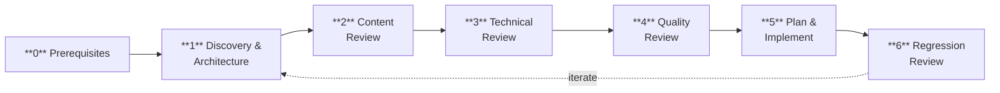
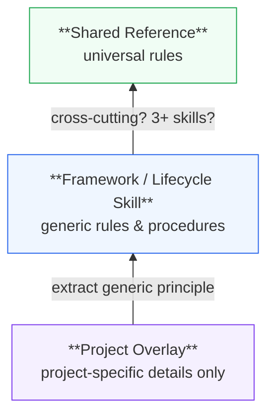

# Review Skillset

Deep, holistic review of one or more skills. Treats selected skills as a connected system, not isolated units.

## Dependencies

Standalone. No hard dependencies on other skills.

**Recommended companions:**

- **`ac-python`** — When the reviewed repo contains Python scripts or tests, load for its integration-first testing philosophy and code style guidelines.
- **`ac-managing-repos`** — When the review scope includes multiple repos that share tooling (or a single repo known to have siblings), load for cross-repo infrastructure comparison (`.pre-commit-config.yaml`, `pyproject.toml`, `.editorconfig`, utility scripts). § 3.2b delegates to this skill automatically.

## Configuration: `~/.ac-reviewing-skills`

On startup, review-skills loads `~/.ac-reviewing-skills` (hardcoded path) if it exists. This file contains user-specific settings for skill review:

```bash
# Regex matched against resolved skill paths.
# Skills whose real path matches are owned by the user and can be modified.
# Non-matching skills require explicit user confirmation before modification.
MAINTAINED_SKILLS="my-repo/|other-repo/internal/(my-skill/)"
```

| Variable | Purpose | Fallback when missing |
|----------|---------|----------------------|
| `MAINTAINED_SKILLS` | Regex for ownership check — skills matching this can be modified freely | Ask user before modifying any skill |
| `DELIVERY_SKILL` | Skill to chain into after review for cross-repo delivery (squash, status, push). E.g., `ac-managing-repos`. | No chaining — review ends after commit. |

**This file is shared with teatree** (which references it via `T3_SKILL_OWNERSHIP_FILE` in `~/.teatree`), but review-skills does not depend on teatree — it reads `~/.ac-reviewing-skills` directly.

To generate this file interactively, teatree users can run `/t3-setup` (Step 8). Non-teatree users create it manually.

## References

- [Anthropic Skill Authoring Best Practices](https://platform.claude.com/docs/en/agents-and-tools/agent-skills/best-practices) — official guide for writing effective skills
- [Agent Skills Overview](https://platform.claude.com/docs/en/agents-and-tools/agent-skills/overview) — skill structure, progressive disclosure, architecture

## Deterministic Checker

This skill ships a deterministic checker at [`scripts/cli.py`](scripts/cli.py).

- In this repo's pre-commit hook, run it directly:

  ```bash
  uv run ac-reviewing-skills/scripts/cli.py
  ```

- When reviewing another skills repo interactively, call it explicitly against that repo before the deeper human review:

  ```bash
  cd /path/to/your/skills-repo
  uv run ac-reviewing-skills/scripts/cli.py --root /path/to/skills-repo
  ```

When the checker is invoked, run in **check-only mode**:

1. **Check `SKILL.md` files only.** Validate frontmatter presence and required fields in the current git repository.
2. **Skip interactive phases.** Do not ask questions, do not implement fixes, do not commit.
3. **Require only structural fields.** Enforce `name`, `description`, and `metadata.version`.
4. **Collect findings** as a list of blocking errors.
5. **Print verdict as the last line of output:**
   - `PASS` — no errors found.
   - `FAIL` — one or more errors found.

This enables integration with pre-commit hooks and CI pipelines that rely on exit codes derived from the final output line.

## Rules

1. **Never delegate to sub-agents.** Review requires full skill context — sub-agents lose loaded skills, MCP access, and shell functions. Do all work sequentially in the main conversation.
2. **Work on the source repo** (git-tracked), never on symlink targets under the active agent runtime's skills directory.
3. **Be thorough, not fast.** Resist the urge to rush to completion. Each phase exists for a reason.
4. **Ask when ambiguous (Non-Negotiable).** When you encounter an unclear design decision, ambiguous scope, or a choice with multiple valid options (e.g., which repos to target, what to remove vs keep, how broad a change should be) — **stop and ask the user**. Do not assume. In checker mode, mark the ambiguous item as an `error` and `FAIL` — the user must run the review interactively to resolve it.
5. **Generic vocabulary only.** Use terms like "project-specific skills", "generic/framework skills", "lifecycle skills", "knowledge-only skills" — never hardcode actual skill names in this file.
6. **Consolidate aggressively.** Critical operational knowledge gets ignored when buried in project-specific playbooks or troubleshooting appendices. The reviewer must actively hunt for such buried knowledge and surface it — either by promoting it to a main skill file or by moving it up to the correct abstraction layer.
7. **Respect content publication status.** Blog posts, articles, and other publishable content may have a `draft` field in their frontmatter. When `draft: true` (or absent), the content may be modified during review (improving diagrams, fixing references, updating stale information). When `draft: false`, the content is published and **must not be modified** — published content is a snapshot in time. Flag issues with published content as findings but do not edit the file.
8. **This skill is meta — it must remain agnostic.** It is written without any specific skill names, project names, repo structures, or tool stacks in mind. It works for any skills repo, not just the one it ships with. Never add instructions that only apply to a particular project or skill system. If a review reveals a pattern specific to one project, the fix goes into that project's skills — not here.

## Quality Principles

Read [`references/quality-principles.md`](references/quality-principles.md) before starting any review. It defines the 7 principles every skill is evaluated against: Reliability, Robustness, Platform Independence, Automation & Escalation, Agent Agnosticism, Self-Improvement, and Skill vs Model Balance.

---

## Review Phases



## Phase 0 — Prerequisites

Before starting the review:

1. **Verify git-tracked source repos.** For each repo in scope (which may be multiple — see step 4), confirm the skill directories are git-tracked sources, not symlink targets. For each repo root, verify: `git rev-parse --git-dir >/dev/null 2>&1` — if this fails, **STOP** for that repo: skill files not in a git repository would lose changes. When the user's cwd is a parent of multiple skill repos (not itself a repo), that's expected — verify each child repo individually.
2. **Symlink health check.** Scan the agent's skills directories (e.g., `~/.agents/skills/`, `~/.claude/skills/`, `~/.codex/skills/`, `~/.cursor/skills/`, `~/.copilot/skills/` — adapt paths for your agent platform) for **maintained skills** (matching `MAINTAINED_SKILLS` regex) that are managed installs instead of live clone symlinks when a git-backed source exists. This catches stale consumer installs where edits to the repo will not affect the active skill. **Only report on skills within the user's maintained scope** — skip non-matching skills silently.

   ```bash
   maintained_re="${MAINTAINED_SKILLS:-}"  # from ~/.ac-reviewing-skills
   for root in ~/.agents/skills ~/.claude/skills ~/.codex/skills ~/.cursor/skills ~/.copilot/skills; do
     [ -d "$root" ] || continue
     for entry in "$root"/*/; do
       [ -e "$entry" ] || continue
       real_path=$(cd "$entry" && pwd -P 2>/dev/null || readlink -f "${entry%/}" 2>/dev/null)
       # Skip skills outside the maintained scope
       [ -n "$maintained_re" ] && ! echo "$real_path" | grep -qE "$maintained_re" && continue
       skill=$(basename "$entry")
       [ -L "${entry%/}" ] && continue  # already a symlink — OK
       # Check if a source exists in any known skill repo
       for repo in "$T3_REPO" "$WORKSPACE_DIR/skills"; do
         if [ -d "$repo/$skill" ] && [ -f "$repo/$skill/SKILL.md" ]; then
           echo "STALE INSTALL: $entry (source: $repo/$skill)"
         fi
       done
     done
   done
   ```

   If stale installs are found, present the list and ask: "These skills do not point at their live git clones. Edits to the repos won't take effect. Rewire them in contributor mode? [yes/no]". On approval, use the repo's contributor installer if it exists; otherwise recreate the symlinks manually. If managed installs have local modifications not in the source, warn and skip those — the user must resolve manually.

3. **Check for unstaged changes.** Run `git status` in each skills repo. If there are uncommitted changes, **commit them before starting the review** — this keeps review changes cleanly separated from pre-existing work and makes the review easier to revert if needed. If unsure whether to commit (e.g., work-in-progress that shouldn't be a standalone commit), ask the user.
4. **Determine review scope.** Use `MAINTAINED_SKILLS` from `~/.ac-reviewing-skills` to discover all repos and skills in scope — parse the full regex and find every matching skill across all workspace repos, not just the current directory. List the discovered skills grouped by repo and ask the user to confirm or narrow the scope. If the user said "full", all maintained skills are in scope — confirm the list but do not ask them to pick. If no config exists, scan for `*/SKILL.md` in the cwd and ask the user to select.
5. **Read all selected skills fully.** Load every `SKILL.md`, every file in `references/`, every script, every hook config. Do not skim — read completely. This is the foundation for all subsequent phases.

---

## Phase 1 — Discovery & Architecture

**Review skills in context.** When reviewing multiple skills, treat them as a connected system — the most dangerous bugs live at the seams where one skill's output becomes another's input. When reviewing a single skill, still check its connections: dependencies, consumers, managed assets, and the agent config entries that reference it. A skill that looks correct in isolation can be broken in context.

### 1.1 Dependency Graph

- Build the dependency graph between selected skills and their neighbors (skills they depend on or that depend on them).
- Check coupling direction: generic/framework skills must NOT import or reference project-specific skills. The reverse (project skills referencing generic ones) is correct.
- Verify that declared dependencies in each `SKILL.md` match actual references in the content.

### 1.2 Architecture Assessment

- Is the current skill decomposition optimal? Are there skills that should be merged, split, or restructured? **Always ask the user before proposing a merge or split** — present the analysis (line counts, overlap, usage patterns, context budget impact) and let the user decide. Never execute a merge/split without explicit approval.
- Are there unnecessary abstraction layers or indirections?
- Is the context budget used efficiently? (Large skills that are always loaded together might benefit from merging; monolithic skills that are partially loaded might benefit from splitting.)
- Do reference files serve a clear purpose? Are any redundant or under-used?
- **Platform coupling:** Do skills mix universal workflow logic with platform-specific API recipes (CLI commands, API URLs, MCP tool names, authentication patterns)? If so, the recipes should be extracted to reference files. See Quality Principles § Platform Independence.
- **Medium assessment (Non-Negotiable).** For each skill, estimate what percentage of its content is **deterministic procedures** (step-by-step commands, exact CLI invocations, config generation) vs. **judgment guidance** (decision trees, heuristics, "when to ask the user", edge-case reasoning). When a skill is >60% deterministic procedures, flag it as a **toolification candidate** — the procedural content should be an executable tool (CLI, script) that the agent calls, with the skill reduced to "when and why to call it." Present the analysis to the user with the split ratio and a concrete proposal. A skill that encodes procedures the agent must interpret and re-issue as commands is strictly less reliable than a tool that executes them directly.

### 1.3 Dependency Documentation

- Every skill must declare its dependencies (or explicitly state "Standalone").
- Cross-skill references must be bidirectional: if skill A references skill B, skill B should acknowledge the relationship.

### 1.4 Managed Assets Inventory (Non-Negotiable)

Skills don't exist in isolation — they reference, generate, or depend on external assets: agent config files, memory files, external repos (e.g., test suites, seed data repos), hook configs, generated dotfiles, and other non-skill files. These assets are part of the skill system even though they live outside the skill repo.

**During discovery, build an inventory of managed assets:**

1. **Scan each skill** for references to external files, repos, or config entries. Look for: file paths, repo names, env vars pointing to external locations, memory file entries, agent config instructions.
2. **Classify each asset:**
   - **Owned by the skill** — generated or directly managed (e.g., hook configs, generated env files). Review as part of the skill.
   - **Referenced by the skill** — consumed but not owned (e.g., test repos, seed data, external tools). Read and cross-review for consistency, but **do not modify without asking the user**.
   - **Instructed by the skill** — the skill tells the agent to write to an external location (e.g., "add this to your memory file", "update the agent's config"). Verify the instructions are current and the target format is correct.

3. **Cross-review for consolidation.** Knowledge often drifts between a skill and its managed assets — a memory file may contain stale rules that the skill has since updated, or a referenced repo may encode conventions that contradict the skill. Flag divergences. **Always ask before modifying external assets** — present the finding and the proposed consolidation, then wait for approval.

4. **No asset-specific names in this skill.** Describe assets generically: "test helper repos", "agent memory files", "seed data repos" — never name specific repos, files, or projects. The inventory is built dynamically during each review from what the skills actually reference.

### 1.5 Cross-Skill Consistency Check (Non-Negotiable)

**This is the single most important step in the review.** Skills that hand off to each other (A creates state → B consumes it) must agree on the contract. Contradictions between skills are the most dangerous bugs — each skill looks correct in isolation, but the system breaks at the seam.

**Mandatory checks:**

1. **Producer-consumer contracts.** For every skill that produces output consumed by another (commits, branches, files, cache entries, API state), verify that the producer's output format matches the consumer's expected input. Example: if skill A says "commit on the current branch" but skill B searches for `feature/*` branches, the contract is broken.
2. **Shared terminology.** Grep for key terms (branch names, file paths, status labels, function names) across all reviewed skills. If the same concept has different names in different skills, one is stale.
3. **Workflow handoff points.** Trace the full lifecycle: ticket → code → test → review → ship → retro → contribute. At each handoff, verify the "output" section of skill N matches the "input" assumptions of skill N+1.
4. **Renamed or removed features.** When a skill references another skill's feature by name (e.g., `/t3-autopilot`), verify the name still exists. Renames are a common source of stale references.

**How to detect:** Don't just read each skill and mentally check — programmatically grep for shared patterns. Extract key terms from each skill (branch naming conventions, script/function names, file paths, skill references) and search for them across all reviewed skills. If the same concept appears with different names or assumptions in different skills, one is stale.

If any cross-skill inconsistency is found, **fix both sides** — not just the one you noticed first.

---

## Phase 2 — Content Review

### 2.1 Duplication & Diverged Copies

- Search for **semantic** duplication across all reviewed skills' markdown files. Two paragraphs saying the same thing in different words count as duplication — not just identical text.
- **Prefer inter-skill dependency over duplication.** When two skills share knowledge, the fix is NOT to copy it into both — it's to put it in one skill and make the other declare a dependency (with auto-loading). This keeps knowledge in one place and forces skills to compose, not duplicate.
- **Guard agnosticism.** When consolidating, verify the receiving skill stays within its abstraction boundary. A generic/framework skill must not absorb project-specific details just to avoid duplication — in that case, the project skill depends on the generic one and adds its project-specific layer on top. **Ask the user if you have ANY doubt** about whether a piece of knowledge belongs in a generic skill or a project-specific one.
- **Diverged copies** are the most dangerous form: the same rule exists in multiple skills but one copy was updated while the other wasn't. To detect: grep for distinctive phrases (token patterns, CLI flags, error messages) and compare the versions across files. If they differ, one is stale.
- **Cross-cutting rules** (rules that apply to ALL skills — e.g., reference formatting, verification standards, temp file safety) need a dedicated shared reference file rather than being duplicated in each skill. If 3+ skills repeat the same rule, create a shared file and replace the copies with cross-references.

### 2.2 Conciseness & Length Reduction

- Every sentence must earn its place. Remove filler, redundant explanations, and over-qualification.
- **Actively reduce skill length.** Shorter skills get read and followed; long skills get skimmed and ignored. During review, measure the total line count of each skill and look for ways to shrink it without losing information or capabilities.
- Never sacrifice completeness for brevity — the goal is concise AND complete. But when the same information appears in two places within a skill (or across skills), that's not completeness — that's redundancy. Merge it.
- **Resolve conflicts.** When two instructions within a skill (or across related skills) contradict each other, the reviewer must fix it — not leave both versions. Determine which is correct (check the codebase, check with the user if unsure), keep that one, delete the other. A skill with conflicting instructions is worse than no skill — it produces unpredictable behavior.

### 2.3 Self-Sufficiency & Knowledge Placement

- Check the user's **personal config files** (for example the repo-level agent instructions file and any agent-specific memory files) for content that **belongs in the skill itself**. If a skill relies on instructions living in the user's personal config, those instructions should be moved into the skill (so other users benefit too).
- Common misplacements: guardrails and "do this, not that" rules → skill's `SKILL.md` or `references/`; troubleshooting entries → `references/troubleshooting.md`; patterns and workflows → playbooks or skill workflows.
- **Only keep in personal config:** user preferences (formatting, tone), environment-specific facts (paths, usernames), user-specific workflow choices.
- **Skills must ask for what they need.** If a skill requires user-specific info (e.g., a branding guide path, a default tenant, a preferred tool), it must: (1) check the agent's memory/config for a stored preference, and (2) **ask the user** if none is found. Never silently skip, hardcode a default, or fail. The skill should also tell the user to store their answer for future sessions.
- **Test:** "Would another user of these skills need this?" — if yes, migrate it to a skill. Flag any skill that works only because of a personal config entry — that's a portability bug.

**Active promotion from personal config (Non-Negotiable):**

During every review, **read the user's personal config and memory files end-to-end**. For each entry, classify it:

| Category | Action |
|---|---|
| Guardrail / "do this, not that" | Promote to skill's `SKILL.md` or `references/` |
| Troubleshooting entry | Promote to `references/troubleshooting.md` |
| Workflow pattern | Promote to playbook or skill workflow |
| User preference (formatting, tone) | Keep in personal config |
| Environment-specific fact (paths, credentials) | Keep in personal config |
| "Safety net" duplicate (rule exists in skill, repeated in config for early loading) | Keep — these exist because skills may not be loaded when the agent needs the rule. Verify the skill source is up to date. |

This is not optional or aspirational — it is a **concrete deliverable** of every review. Knowledge stuck in one user's config is a portability bug. The review must produce commits that move promotable entries into skills.

### 2.3b Cross-Repo Memory Scan (Non-Negotiable)

Skills reference code repos (via managed assets, dependencies, worktree configs, or documented repo lists). Each code repo may have **agent memory files** (e.g., `~/.claude/projects/-<encoded-path>/memory/*.md`) containing guardrails, patterns, and troubleshooting entries that were saved as "feedback" or "project" memories but belong in skills.

**Procedure:**

1. **Discover referenced repos.** From Phase 1.4 (Managed Assets Inventory), collect all code repo paths the reviewed skills reference — workspace repos, overlay repos, private test repos.
2. **Find memory directories.** For each repo path, derive the encoded project directory and check for memory files:

   ```bash
   # Derive the memory path from a repo's absolute path
   # (Replace / with - and strip the leading -)
   repo_path="/Users/someone/workspace/my-project"
   encoded=$(echo "$repo_path" | tr '/' '-' | sed 's/^-//')
   memory_dir="$HOME/.claude/projects/$encoded/memory"
   [ -d "$memory_dir" ] && ls "$memory_dir"/*.md 2>/dev/null
   ```

   Also check for agent memory/config directories from other platforms (`~/.codex/`, `~/.cursor/`, etc.) if they exist.

3. **Read and classify each memory file.** Apply the same table from § 2.3:
   - Guardrails, patterns, troubleshooting → **promote to skill**
   - User preferences, env-specific facts → **keep**
   - Stale entries (completed tickets, outdated info, duplicates of existing skills) → **delete**

4. **Privacy gate before promotion (Non-Negotiable).** Before promoting content from a memory file into a skill file, check whether the target skill is in a **public repository**:

   ```bash
   # Check if the skill repo has a public remote
   cd "$skill_repo"
   remote_url=$(git remote get-url origin 2>/dev/null)
   # If the remote is public (github.com, gitlab.com without private group),
   # the promoted content must not contain:
   # - Internal hostnames, URLs, or IP addresses
   # - Customer/tenant names or company-specific terms
   # - Credentials, tokens, or API keys
   # - Internal team names or org-specific processes
   ```

   If the target skill is public and the memory content contains internal details: **generalize** the content (strip names, URLs, specifics) before promoting. If the content cannot be meaningfully generalized, keep it in memory and note why.

5. **Promote and clean up.** For each promotable entry:
   - Add the content to the appropriate skill file (following the placement table in § 2.3)
   - Delete the memory file
   - Update the `MEMORY.md` index
   - If the memory was the last file in the directory, remove the empty directory

6. **Report.** Include a summary in the review output: how many memory files scanned, how many promoted, how many kept, how many deleted as stale.

### 2.4 Skill ↔ Repo Config Boundary (Non-Negotiable)

Repos often have their own `AGENTS.md` or other repo-level agent instruction file with project rules. Skills must **not duplicate** these — they should **reference** them.

- **Do not copy rules from a repo's agent instruction files into skill files.** The repo file is the source of truth for repo-specific conventions. Skills should ensure the agent reads it (e.g., "Read `AGENTS.md` before starting") rather than restating its content.
- **When a skill adds extra detail** beyond what the repo file says (deeper rationale, examples, edge cases), write the extra detail in the skill and **reference the repo file** for the base rule. This way the repo owner can update their file without causing drift.
- **Duplication is tolerated ONLY when fully acknowledged.** If a rule is intentionally repeated (e.g., as a safety net for context loss), mark it clearly with a reference to the authoritative source: `(Source: AGENTS.md § Container-Presentational Pattern)`. A duplicate without a reference is a duplication bug — it will drift silently.
- **Detection during review:** Diff the repo's agent instruction files against skill reference files. Any paragraph that says essentially the same thing in both places is a finding — either remove the skill copy (add a reference) or mark it as an acknowledged duplicate with source attribution.

### 2.5 Information Boundaries

- Generic/framework skills must not contain project-specific or proprietary details (internal URLs, team names, specific repo paths, company-specific conventions).
- Project-specific skills may reference their project freely but should not leak into generic skills.
- **Active scan (non-negotiable).** Grep all reviewed skill files (markdown AND scripts) for project names, product names, customer names, internal hostnames, and proprietary terms. This must be a concrete search, not a visual skim. Any hit in a generic/framework/lifecycle skill is a blocker — either generalize the content or move it to the project overlay. If the knowledge has value, transfer it to the user's personal memory file before removing it from the skill.

### 2.6 Knowledge Consolidation (Buried Playbook Problem)

Critical operational knowledge frequently gets buried inside project-specific troubleshooting sections, playbook appendices, or guardrail lists — where it gets ignored during execution. This is the **single most common failure mode** in multi-skill systems: the agent violates a rule not because it disagrees, but because it never sees it.

**Detection:** Read every troubleshooting section, playbook, guardrail list, and FAQ. For each item, ask: "Is this specific to this project, or is it a general mechanism?" Common mis-filed general mechanisms: environment isolation, infrastructure self-healing, generated files discipline, service lifecycle. Flag items where the **principle is generic** but the **wording is project-specific**.

**Remediation — surface, relocate, and implement (not just identify):**

Each buried item must result in concrete edits in Phase 5. Identification without implementation is a waste.



1. **Promote within the skill.** Core rules buried in troubleshooting appendices → move to the skill's main Rules section. Rules at the top get followed; playbooks at the bottom get skipped.
2. **Move up the abstraction layer.** Generic principle in a project overlay → extract to the framework/lifecycle skill (without project-specific names). Slim the project skill to a cross-reference + project-specific details only.
3. **Pair prohibitions with positive procedures.** "Never do X" must come with "Instead, do Y: step 1 → step 2 → step 3."
4. **Cross-reference both directions.** Old location → "see [skill] § [rule]". New location → "project-specific: see [overlay] § [section]".

**Verification:** Grep for "manual", "hand-edit", "workaround" in project-specific files. Any surviving instance describing a general mechanism = incomplete consolidation. Every prohibition must have a corresponding positive procedure.

### 2.7 Cross-References

- Verify all cross-references between skills are accurate (correct file paths, correct skill names, correct section headings).
- Check for broken links to reference files, scripts, or external URLs.
- **Programmatic verification:** For each skill, extract relative paths from markdown links and verify the targets exist on disk. A quick shell loop catches broken references that visual scanning misses:

  ```bash
  for skill in */SKILL.md; do
    dir=$(dirname "$skill")
    grep -oE '\.\./references/[a-z-]+\.md' "$skill" | while read ref; do
      [ -f "$dir/$ref" ] || echo "BROKEN: $skill → $ref"
    done
  done
  ```

### 2.8 No Personal or Hardcoded Paths

Skills must be portable — no hardcoded personal paths, personal repo names, or user-specific directories.

**Scan all skill markdown and script files for:**

- Hardcoded home directories (`~/workspace`, `/Users/<name>/`, `/home/<name>/`)
- Personal repo names that aren't the canonical project name (e.g., a user's private test repo)
- Hardcoded usernames, email addresses, or user IDs (unless in a test fixture)

**How to fix:**

- Replace hardcoded workspace paths with the appropriate env var (e.g., `$WORKSPACE_DIR`, `$PROJECT_ROOT`). Check the repo's prerequisites or env docs for the canonical variable name.
- For values that vary per user (private repo paths, personal tool locations), define a **placeholder** in the skill (e.g., "your private E2E repo") and document that the real value should be set in the user's personal config or memory file.
- Skills that need a user-specific value at runtime should **ask the user** on first use, then instruct the user to store it in their agent's memory for future sessions.

### 2.9 Guardrail Classification

Classify each Non-Negotiable rule and guardrail into one of two categories:

- **Domain guardrail** — encodes project/infrastructure knowledge the model will never learn from training data: credentials, repo layout, tool-specific pitfalls (renamed CLI flags, undocumented API quirks), migration ordering, environment isolation rules. **Never relax** — these are permanent.
- **Model-limitation guardrail** — compensates for current model weaknesses: spiraling on troubleshooting, false completion claims, not verifying results, confidently using outdated CLI syntax. **Review periodically** — when a new model generation ships, test whether the guardrail is still needed before relaxing it.

**How to classify:** Ask "Would a brilliant, experienced new hire need to be told this, or would they figure it out?" If they'd figure it out, it's likely a model-limitation guardrail. If even an expert would get it wrong without being told (because the knowledge isn't public or is counter-intuitive), it's a domain guardrail.

**During review:** Don't remove or relax any guardrails — only classify them. Record the classification as a note in the change plan. This metadata informs future reviews: when a model upgrade ships, the reviewer checks model-limitation guardrails first for candidates to simplify.

**Model obsolescence check:** If a guardrail classified as model-limitation appears to be **universally obvious to current models** (e.g., the model now consistently does it right without being told), flag it as a removal candidate. **Always ask the user before removing** — what seems obvious to the model today may regress in edge cases or under context pressure. Present the evidence ("this rule was violated 0 times in the last N sessions") and let the user decide.

### 2.10 Multi-Layer Skill Overlap & Promotion

When a skill ecosystem spans multiple layers — e.g., **team skills** (shared across all team members), **personal generic skills** (the user's own reusable skills), and **personal project overlays** (project-specific customizations) — content frequently migrates between layers over time. A rule born in a personal overlay may later be adopted as a team standard, or a team skill may incorporate content that originated in a personal skill.

**Detection — during every review of a multi-layer system:**

1. **Identify the layer hierarchy.** Typically: team skills (broadest audience) → personal generic skills (reusable across projects) → personal project overlays (project-specific). The correct flow of promotion is upward: overlay → generic → team.
2. **Scan for content that has been promoted.** When a team skill contains content that originated in a personal skill (or vice versa), the personal copy is now redundant. Grep for distinctive phrases across layers to find duplicates.
3. **Classify each overlap:**

| Overlap location | Action |
|---|---|
| **Personal skill duplicates team skill** | Remove from personal skill. Add cross-reference: "Promoted to `<team-skill>`. See `<team-skill>` § `<section>`." Keep any extra detail the team skill doesn't cover. |
| **Team skill duplicates personal skill** | The team skill is the new authority. Clean up the personal copy as above. |
| **Personal overlay duplicates personal generic** | Remove from overlay if the generic skill covers it. Overlay should only add project-specific details on top. |
| **Conflict between layers** | **Ask the user.** Present both versions and propose resolution: (a) align the personal skill to match the team standard, (b) promote the personal version to the team skill if it's better, or (c) document the intentional divergence with a rationale. |

4. **Preserve attribution implicitly.** When removing content that has been promoted to a team skill, use the phrase "has been promoted to" rather than "was copied by" or "was taken from". The goal is accurate knowledge management, not credit assignment.
5. **Check for information loss.** Before removing a personal copy, verify the team skill covers all the detail. If the personal skill has deeper examples, edge cases, or rationale that the team skill lacks, either promote those too (with user approval) or keep them as supplementary references that cross-reference the team skill for the base rule.

**This check is especially important when the personal skill was the original source.** Content that flows from personal → team often loses nuance in the condensation. The reviewer must verify that critical details survived the promotion, and flag any gaps back to the team skill maintainer.

---

## Phase 3 — Technical Review

### 3.1 Script Language & Conventions

- **Shell → Python assessment.** Shell scripts that perform non-trivial logic (conditionals, loops, string manipulation, JSON parsing) are candidates for conversion to Python. During review, flag such scripts and **ask the user before converting** — some may have good reasons to stay as shell (e.g., sourced for env vars, POSIX portability).
- **Python script standards.** Python scripts should use:
  - **uv shebang** (`#!/usr/bin/env -S uv run --script`) for standalone executability without manual virtualenv activation.
  - **uv inline metadata** (`# /// script` block) to declare Python version and dependencies directly in the file — no separate `requirements.txt` needed.
  - **Typer** (`typer[all]`) for CLI argument parsing — provides automatic `--help`, type validation, and shell completion with minimal boilerplate. Prefer Typer over `argparse`, `click`, or manual `sys.argv` parsing. For table output, use `rich.Table` (transitive dependency of typer) — never hand-format tables with f-string padding.
  - **Ask before converting** existing scripts. When reviewing scripts that use `argparse`, `click`, or bare `sys.argv`, flag them as candidates for Typer conversion but get user approval first — the conversion may not be worth the churn for stable, rarely-edited scripts.
- Check whether the repo defines additional script conventions (naming, logging, error handling). If so, verify all scripts conform.
- If no conventions are documented, check the repo's pre-commit hooks and linter config — they often encode implicit standards.

### 3.2 Pre-Commit Hooks

- Audit existing pre-commit hooks. Are there enforceable patterns that lack hooks?
- For new hooks: prefer well-maintained, popular community hooks. For project-specific checks, prefer simple `pygrep` one-liners over custom scripts.
- Verify that hook file patterns (`files:` regexes) correctly match the intended files — including newly added skills.
- **Co-location:** When a skill moves between repos, its supporting infrastructure (pre-commit hooks, scripts, tests) must move with it. Ask the user which repos should get the hook — don't assume all skill repos need it.

### 3.2b Cross-Repo Infrastructure Harmonization

**Delegate to `ac-managing-repos`.** When the review scope includes multiple repos (or a single repo known to share tooling with sibling repos), load `ac-managing-repos` and run its infrastructure audit workflow on all repos in scope. It compares `.pre-commit-config.yaml`, `pyproject.toml`, `.editorconfig`, and utility scripts — identifying drift, proposing alignment, and implementing fixes.

This step is most valuable during scheduled full reviews. For single-skill reviews, only trigger if the reviewed skill's repo shares tooling with known sibling repos (e.g., skill repos, boilerplate repos).

### 3.3 Script Verification

- **Python scripts:** Check syntax (`python3 -m py_compile <file>`), verify imports resolve, confirm CLI structure matches the repo's conventions.
- **Shell scripts:** Check syntax (`bash -n <file>`).
- Do NOT run scripts that have side effects — only verify they are syntactically correct.

### 3.4 Hook Scripts (Agent Platform Hooks)

- If the skill includes agent platform hook scripts (e.g., Claude Code hooks in `settings.json`, Codex hooks, or custom integrations in `integrations/`), verify they are correct and functional.
- Check that hook event types match the intended trigger points.

### 3.5 Code Quality & Simplification

Scripts are production code — they must be maintainable, not just functional.

- **Dead code.** Grep for unused functions, unreachable branches, commented-out blocks, and obsolete imports. Remove them — dead code misleads readers and hides bugs.
- **Complexity.** Flag functions longer than ~50 lines or with deep nesting (3+ levels). Extract helper functions or simplify control flow. Prefer early returns over nested conditionals.
- **Duplication across scripts.** If two scripts share logic (e.g., config parsing, API calls, path resolution), extract to a shared module in `lib/`. But don't over-abstract — only extract when the duplication is real (3+ copies or divergence risk), not speculative.
- **Test quality.** Don't just check that tests exist — verify they cover the important paths. A test that only checks the happy path on a script with complex error handling is insufficient. Flag gaps, but **ask before writing new tests** — the user may prefer to defer.
- **Simplification with safety.** When simplifying, ensure no features are lost and no behavior changes. Run existing tests before AND after refactoring. If no tests exist, **ask the user** whether to add tests first or skip simplification.
- **Readability.** Meaningful variable names, consistent naming conventions, clear function signatures. Code that requires a comment to explain what it does should be rewritten to be self-explanatory instead.
- **Prose → script candidates.** For every inline multi-step procedure (3+ steps), apply the script-vs-prose decision flowchart from [`references/quality-principles.md`](references/quality-principles.md) § Skill vs Model Balance. Scripts are more reliable but cost maintenance. The sweet spot: script what the model gets wrong (deterministic, exact, tool-quirk-heavy), leave as prose what the model handles well (judgment calls, well-known domains, frequently changing steps). **Always ask the user before converting** — they know the maintenance cost.

### 3.6 Security Review

Skills instruct an agent that can execute arbitrary code, access APIs, and modify infrastructure. Security is not optional.

**Scripts and hooks:**

- **No hardcoded secrets.** Grep all scripts and skill files for tokens, passwords, API keys, private keys. Secrets must come from environment variables, password managers, or credential stores — never from skill files.
- **No unsafe shell patterns.** Check for unquoted variables in shell scripts (`$VAR` instead of `"$VAR"`), `eval` on user input, unchecked `curl | bash`, or `os.system()` with string interpolation. These are injection vectors.
- **Principle of least privilege.** Scripts should request only the permissions they need. A script that reads a config file should not require write access. A hook that validates metadata should not modify files.
- **No destructive operations without confirmation.** Scripts that delete files, drop databases, force-push, or modify shared infrastructure must either require explicit user confirmation or be gated behind a `--force` flag that defaults to dry-run.

**Skill instructions:**

- **No instructions that bypass safety.** Skills must never tell the agent to skip hooks (`--no-verify`), disable SSL verification, ignore certificate errors, or run as root/admin unless absolutely necessary and explicitly justified.
- **Alert on suspect patterns.** If a skill instructs the agent to download and execute remote code, modify system files, or grant broad permissions, **flag it immediately** to the user — even if it appears intentional. Better to ask and confirm than to silently enable a dangerous workflow.
- **Credential handling.** Skills that involve authentication must document where credentials come from and how they're scoped. Never instruct the agent to store tokens in plain text files, commit credentials, or pass secrets via command-line arguments (visible in process lists).

**When in doubt, flag it.** If anything looks suspect or potentially dangerous — even if you're not sure it's a real risk — surface it to the user. False positives cost a question; false negatives cost a breach.

**Supply chain license compatibility:**

- **Check every dependency** introduced by skill scripts (Python packages in `# /// script` metadata, pre-commit hook repos, npm packages, any external tool the skill instructs to install). Verify the dependency's license is compatible with the project's license.
- **Blockers:** GPL and LGPL dependencies in MIT/Apache-licensed projects are license violations. AGPL is a blocker in almost all contexts. Flag these immediately.
- **Safe licenses:** MIT, Apache 2.0, BSD (2-clause and 3-clause), ISC, Unlicense, CC0 are compatible with MIT projects.
- **Detection:** For Python scripts with inline metadata, extract dependencies from the `# /// script` block and check each package's license via `pip show <pkg>` or PyPI metadata. For pre-commit hooks, check the hook repo's LICENSE file.
- **Transitive dependencies matter.** A direct MIT dependency that pulls in a GPL transitive dependency is still a problem. When flagging a new dependency, check `pip show <pkg>` for its `Requires` field and spot-check the license chain.
- **Ask when unclear.** Some licenses (MPL 2.0, EUPL, dual-licensed packages) require case-by-case assessment. Flag them to the user with the license text and let them decide.

### 3.7 CLI vs MCP Tool Preference

**Prefer native CLI tools over MCP when available.** MCP tools add server overhead, reduce portability across agent platforms, and are harder to debug than standard CLI tools.

- **Detection:** Grep skill files and scripts for `mcp__` references. For each hit, check whether a well-maintained CLI exists for the same service (e.g., `glab` for GitLab, `gh` for GitHub, `slack` CLI for Slack, `notion` CLI if available).
- **Inform and propose.** Present findings to the user with a migration proposal — don't migrate silently. Some MCP tools may have capabilities that the CLI lacks, so the user must decide.
- **Migration scope:** When the user approves, update skill files, reference docs, scripts, and hook configs to use the CLI equivalent. Update permission allowlists if needed (e.g., replacing `mcp__glab__*` with `Bash(glab:*)` in agent settings).
- **Exception:** If the MCP tool provides capabilities that have no CLI equivalent (e.g., rich structured queries, platform-specific integrations), document why MCP is preferred and skip migration.

### 3.8 Single CLI Entrypoint per Skill (Non-Negotiable)

Each skill that ships scripts must have **exactly one CLI entrypoint** — a single `scripts/cli.py` using Typer. All commands hang off that one app.

- **Detection:** For each skill with a `scripts/` directory, check for multiple executable Python files (`#!/usr/bin/env` shebang or executable permission). If more than one file can be invoked directly from the command line, flag it.
- **Fix:** Integrate secondary scripts as subcommands of the main `scripts/cli.py` Typer app. Then remove the shebang and executable permission from the secondary scripts (they become internal modules imported by the CLI).
- **Exception:** Helper modules imported by `cli.py` (in `scripts/lib/`) are fine — they're not entrypoints.
- **Rationale:** Multiple entrypoints create discoverability problems. Users and other skills shouldn't have to guess which script to call. One CLI = one `--help` that shows everything.

### 3.9 Sub-Agent Safety Classification

- Check each skill's `subagent_safe` metadata field. Default is `false` (unsafe).
- A skill is safe for sub-agents only if it is pure methodology/guidelines with **no dependency on**: sourced shell functions, MCP tools, environment variables from worktree setup, running services, or cross-skill state.
- **Quick heuristic:** if a skill declares a dependency on an infrastructure/workspace skill, it is unsafe.
- Flag any skill marked `subagent_safe: true` that references shell functions, MCP tools, or infrastructure skills in its workflows.

### 3.10 Test Coverage & Quality

- Check for test files covering the skill's scripts.
- Flag scripts that lack tests.
- Verify existing tests pass (run `pytest` for the relevant test module).
- **Integration-first check.** Evaluate test distribution (see `ac-python` § Testing if loaded):
  - Happy paths should be covered by integration tests that exercise multiple modules together.
  - Unit tests should focus on edge cases, error branches, and boundary conditions.
  - Flag test suites where every function has its own unit test but no integration test exercises the full flow — this is inverted coverage that catches trivial bugs while missing contract violations.
- **Test conciseness.** Flag verbose test patterns:
  - Copy-pasted test methods that differ only by input values (should be `@pytest.mark.parametrize`).
  - Repeated setup code across methods (should be fixtures).
  - Over-mocking that makes tests tautological (testing the mocks, not the code).
  - Test methods named after implementation (`test_function_name`) instead of behavior (`test_returns_error_when_missing`).

### 3.11 Upstream First — Prefer FOSS Contribution Over Custom Solutions

When reviewing scripts, utilities, or workarounds in skills or their managed repos, actively look for opportunities to **contribute upstream** instead of maintaining custom code.

**Detection — ask these questions for every non-trivial script or workaround:**

1. **Is this a workaround for a bug or missing feature in a tool we already use?** If yes, check the tool's issue tracker — the fix may already exist in a newer version, or an issue/PR may be open. If not, suggest opening one. A merged upstream fix eliminates maintenance burden permanently.
2. **Is this reimplementing something a well-maintained FOSS project already does?** Search for popular, safe, actively maintained alternatives before accepting custom code. Prefer adopting an existing project (even if it requires a small PR to cover our use case) over maintaining a parallel implementation.
3. **Could this custom solution benefit others?** If the code solves a general problem (not project-specific), suggest extracting it into a standalone FOSS package or contributing it to a relevant existing project.

**Action — push the user toward collaboration:**

- **When a workaround targets a tool we use:** propose opening an issue or MR/PR on that tool's repo. If the fix is straightforward, draft the PR as part of the review.
- **When custom code duplicates an existing FOSS project:** propose replacing the custom code with the FOSS dependency, plus a contribution PR if the FOSS project is missing a small feature we need.
- **When no suitable project exists:** flag it as a candidate for extraction into a standalone package — but only if it's general enough to be useful to others. Don't over-engineer a one-off script into a library.
- **Default stance:** maintaining custom code has a compounding cost. Every upstream contribution is an investment that pays off through community maintenance, testing, and improvements we get for free. Nudge the user to contribute rather than accumulate private workarounds.

**Do not block on this.** Upstream contributions are recommendations, not blockers. Record them as findings in the change plan and let the user prioritize. But be persistent — if the same workaround survives multiple reviews without an upstream attempt, escalate the recommendation.

---

## Phase 4 — Quality Review

### 4.1 Production-Grade Standard

- Every skill should be production-grade and open-source-ready, even if it's internal.
- This means: clear writing, consistent formatting, no TODO/FIXME/HACK left unaddressed, no placeholder content.

### 4.2 Attribution

- If a skill draws from external sources (blog posts, open-source projects, methodologies), verify that proper credit is given as a reference in that skill's `SKILL.md` (not in the repo README).
- Format: a `## References` section with links.

### 4.3 Agent Agnosticism Check

- **Scan for platform-specific language** in all reviewed skills. Grep for agent brand names, agent-home paths, agent config filenames, and explicit tool names.
- **Classify each hit:** (a) platform integration skill → OK, (b) example/parenthetical → OK, (c) hardcoded in rule/instruction → must generalize.
- **Ask the user** if unsure whether a reference is intentional or should be generalized.
- See Quality Principles § Agent Agnosticism for the full standard.

### 4.4 Attention to Detail

- Typos, grammar issues, inconsistent capitalization.
- Broken or outdated links.
- Stale references to removed features, renamed files, or deprecated patterns.

### 4.5 Formatting Consistency

- Consistent heading hierarchy across skills.
- Consistent list style (dashes vs. numbers, spacing).
- Consistent code block language annotations.
- Consistent YAML frontmatter structure.

### 4.6 Skill Authoring Best Practices

Evaluate reviewed skills against the [skill authoring best practices reference](references/skill-authoring-best-practices.md), which consolidates Anthropic's official spec and Cherny's recommendations. Key checks:

- **Frontmatter.** Validate `name` and `description` against the spec (max lengths, allowed chars, third person, trigger phrases).
- **Conciseness.** SKILL.md body under ~500 lines. Move detailed content to reference files.
- **Progressive disclosure.** Reference files one level deep. No deeply nested chains (SKILL -> A -> B -> actual info).
- **Degrees of freedom.** Match specificity to fragility — high freedom for judgment calls, low freedom for fragile/exact sequences.
- **Consistent terminology.** One term per concept throughout.
- **Workflows with feedback loops.** Complex tasks need clear steps; critical operations need validate -> fix -> repeat loops.
- **Scripts over prose.** Deterministic operations should be callable scripts, not multi-step inline procedures.
- **No time-sensitive info.** Avoid "before date X, use Y" patterns.
- **Evaluation-driven development.** Skills should be built incrementally from observed agent failures, not speculatively.
- **Self-improvement loop.** Every correction should become a skill update, not just a code fix.

**Intentional deviations (document, don't flag):** Some skill systems intentionally deviate from Anthropic's defaults for good reasons. Common justified deviations include: extra frontmatter fields for internal tooling (e.g., `compatibility`, `metadata.version`, `requires`), naming conventions that prioritize namespace grouping over gerund form (e.g., `t3-*` prefixes), skills exceeding 500 lines when encoding domain knowledge the model structurally cannot have, reference nesting deeper than one level when organized as curated collections (e.g., `references/playbooks/`), and custom auto-loading mechanisms that replace description-based discovery. When a deviation is found, **ask the user** whether it's intentional before flagging it as an issue.

---

## Phase 5 — Plan & Implement

### 5.1 Change Plan

- Compile all findings from Phases 1-4 into a structured change plan.
- Group changes by skill and by type (architecture, content, technical, quality).
- For each change, state: what, why, and the specific files affected.

### 5.2 Progressive Clarification (Non-Negotiable)

- Present the change plan with non-ambiguous items as "will do" (no question needed).
- For each ambiguous item (merge vs. split, keep vs. remove, design choices), ask the user **one question at a time** using the agent's native question tool. Wait for the answer before asking the next.
- **Never dump a wall of questions or ask for batch approval.** This overwhelms the user and leads to missed answers.

### Implement, Don't Postpone (Non-Negotiable)

When review identifies concrete improvements (toolification candidates, script extraction, prose slimming), **implement them in the same session** rather than adding TODO comments. TODO comments are a form of postponement. If it's worth flagging during review, it's worth doing now. Flagging something as "candidate" and moving on wastes the review session.

### 5.4 Implementation

- **Ownership check before each file edit (Non-Negotiable):** Before modifying any skill file, resolve its real path and check it against the `MAINTAINED_SKILLS` regex from `~/.ac-reviewing-skills`. If the file doesn't match (or the config file doesn't exist), **ask the user** before modifying. See § Configuration for the file format.
- Implement all approved changes.
- After each logical group of changes, briefly summarize what was done.

---

## Phase 6 — Regression Review

### 6.1 Commit

- **Always commit after implementation** — do not wait for the user to ask. If unsure about the commit scope, ask; but never leave changes uncommitted without at least offering.
- Commit all changes with a clear conventional commit message summarizing the review scope.
- **Suggest squashing fixup commits** when multiple small review commits accumulate before pushing. But **never rewrite settled commits (Non-Negotiable).** This means: (1) never rewrite commits already pushed to origin, and (2) even on local-only branches, never rewrite commits that predate the current work session — they are settled history. Before any squash, check `git log origin/<branch>..HEAD` and **ask the user which commit range is in scope** rather than assuming all local commits are fair game.

### 6.2 Second Pass

- Do a **full second review pass** over the same skills. Changes can introduce regressions: broken cross-references, new duplication, formatting inconsistencies.
- This pass should be faster but equally thorough.

### 6.3 Pre-Commit Verification

- Run the repo's pre-commit checks (e.g., `prek run --all-files`).
- Fix any failures.

### 6.4 Final Commit

- If the second pass or pre-commit produced fixes, create a follow-up commit.
- Run pre-commit checks again to confirm clean.

### 6.5 Definition of Done

**"Done" means re-running this review on the same scope produces zero new findings.** Before claiming the review is complete:

1. Re-run Phases 2-4 mentally on every file you changed.
2. If any check would produce a new finding, fix it now.
3. The user should never have to request a verification pass — that means you declared done prematurely.

### 6.6 Squash Own Commits

Before chaining to the next skill, squash review-related commits into clean, human-sized units. Follow the squash rules from `ac-managing-repos` § Workflow 2 (the canonical source):

- Never rewrite pushed history.
- Group by topic, keep human-sized.
- Squash integrity check before/after.
- Respect `T3_AUTO_SQUASH`.

### 6.7 Chain to Delivery Skill

If `DELIVERY_SKILL` is configured in `~/.ac-reviewing-skills`, load it and trigger its workflow after the review is complete and commits are squashed. This enables the full chain:

```text
t3-retro → ac-reviewing-skills → DELIVERY_SKILL (e.g., ac-managing-repos)
```

The delivery skill handles infrastructure audit, additional squashing, and final delivery status across all managed repos.

If `DELIVERY_SKILL` is not configured, end the review normally.

### 6.8 Retro & Iteration

- After the review is complete, **run the retro skill** (if one exists in the system) to capture any lessons learned during the review itself — meta-improvements to the review process, skill patterns discovered, or recurring issues that suggest a systemic gap.
- **If the user requests iteration** ("review again", "keep improving", "until it's perfect"), loop back to Phase 1 with a narrower focus: skip the full discovery phase and concentrate on areas where the first pass made changes. Each iteration should find fewer issues. Stop when a pass produces zero findings or only cosmetic nits.
