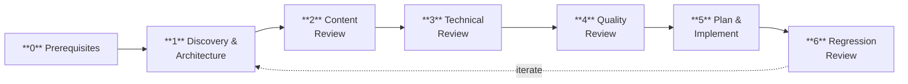

# Review Skillset

Deep, holistic review of one or more skills. Treats selected skills as a connected system, not isolated units.

## Dependencies

Standalone. No hard dependencies on other skills.

**Recommended companions (load during Phase 0 if applicable):**

- **`ac-python`** — When the reviewed repo contains Python scripts or tests, load for its integration-first testing philosophy and code style guidelines.
- **`ac-django`** — When the reviewed repo uses Django (check for `django` in dependencies or `manage.py`), load for Django-specific patterns and conventions.
- **`ac-managing-repos`** — When the review scope includes multiple repos that share tooling (or a single repo known to have siblings), load for cross-repo infrastructure comparison (`.pre-commit-config.yaml`, `pyproject.toml`, `.editorconfig`, utility scripts). § 3.2b delegates to this skill automatically.

**Companion loading is not optional when the condition matches.** If the reviewed code is Python, load `ac-python`. If it uses Django, load `ac-django`. Skipping companions leads to incomplete reviews — the reviewer misses framework-specific patterns that the companion skill would catch.

## Configuration: `~/.ac-reviewing-skills`

On startup, review-skills loads `~/.ac-reviewing-skills` (hardcoded path) if it exists. This file contains user-specific settings for skill review:

```bash
# Regex matched against resolved skill paths.
# Skills whose real path matches are owned by the user and can be modified.
# Non-matching skills require explicit user confirmation before modification.
MAINTAINED_SKILLS="my-repo/|other-repo/internal/(my-skill/)"
```

| Variable | Purpose | Fallback when missing |
|----------|---------|----------------------|
| `MAINTAINED_SKILLS` | Regex for ownership check — skills matching this can be modified freely | Ask user before modifying any skill |
| `DELIVERY_SKILL` | Skill to chain into after review for cross-repo delivery (squash, status, push). E.g., `ac-managing-repos`. | No chaining — review ends after commit. |

**This file is shared with teatree** (which references it via `T3_SKILL_OWNERSHIP_FILE` in `~/.teatree`), but review-skills does not depend on teatree — it reads `~/.ac-reviewing-skills` directly.

To generate this file interactively, teatree users can run `/t3-setup` (Step 8). Non-teatree users create it manually.

## References

- [Anthropic Skill Authoring Best Practices](https://platform.claude.com/docs/en/agents-and-tools/agent-skills/best-practices) — official guide for writing effective skills
- [Agent Skills Overview](https://platform.claude.com/docs/en/agents-and-tools/agent-skills/overview) — skill structure, progressive disclosure, architecture

## Deterministic Checker

This skill ships a deterministic checker at [`scripts/cli.py`](scripts/cli.py).

- In this repo's pre-commit hook, run it directly:

  ```bash
  uv run ac-reviewing-skills/scripts/cli.py
  ```

- When reviewing another skills repo interactively, call it explicitly against that repo before the deeper human review:

  ```bash
  cd /path/to/your/skills-repo
  uv run ac-reviewing-skills/scripts/cli.py --root /path/to/skills-repo
  ```

When the checker is invoked, run in **check-only mode**:

1. **Check `SKILL.md` files only.** Validate frontmatter presence and required fields in the current git repository.
2. **Skip interactive phases.** Do not ask questions, do not implement fixes, do not commit.
3. **Require only structural fields.** Enforce `name`, `description`, and `metadata.version`.
4. **Collect findings** as a list of blocking errors.
5. **Print verdict as the last line of output:**
   - `PASS` — no errors found.
   - `FAIL` — one or more errors found.

This enables integration with pre-commit hooks and CI pipelines that rely on exit codes derived from the final output line.

## Rules

1. **Never delegate to sub-agents.** Review requires full skill context — sub-agents lose loaded skills, MCP access, and shell functions. Do all work sequentially in the main conversation.
2. **Work on the source repo** (git-tracked), never on symlink targets under the active agent runtime's skills directory.
3. **Be thorough, not fast.** Resist the urge to rush to completion. Each phase exists for a reason.
4. **Ask when ambiguous (Non-Negotiable).** When you encounter an unclear design decision, ambiguous scope, or a choice with multiple valid options (e.g., which repos to target, what to remove vs keep, how broad a change should be) — **stop and ask the user**. Do not assume. In checker mode, mark the ambiguous item as an `error` and `FAIL` — the user must run the review interactively to resolve it.
5. **Generic vocabulary only.** Use terms like "project-specific skills", "generic/framework skills", "lifecycle skills", "knowledge-only skills" — never hardcode actual skill names in this file.
6. **Consolidate aggressively.** Critical operational knowledge gets ignored when buried in project-specific playbooks or troubleshooting appendices. The reviewer must actively hunt for such buried knowledge and surface it — either by promoting it to a main skill file or by moving it up to the correct abstraction layer.
7. **Respect content publication status.** Blog posts, articles, and other publishable content may have a `draft` field in their frontmatter. When `draft: true` (or absent), the content may be modified during review (improving diagrams, fixing references, updating stale information). When `draft: false`, the content is published and **must not be modified** — published content is a snapshot in time. Flag issues with published content as findings but do not edit the file.
8. **This skill is meta — it must remain agnostic.** It is written without any specific skill names, project names, repo structures, or tool stacks in mind. It works for any skills repo, not just the one it ships with. Never add instructions that only apply to a particular project or skill system. If a review reveals a pattern specific to one project, the fix goes into that project's skills — not here.

## Quality Principles

Read [`references/quality-principles.md`](references/quality-principles.md) before starting any review. It defines the 7 principles every skill is evaluated against: Reliability, Robustness, Platform Independence, Automation & Escalation, Agent Agnosticism, Self-Improvement, and Skill vs Model Balance.

---

## Review Phases


```mermaid
flowchart LR
    P0["**0** Prerequisites"] --> P1["**1** Discovery &<br/>Architecture"]
    P1 --> P2["**2** Content<br/>Review"]
    P2 --> P3["**3** Technical<br/>Review"]
    P3 --> P4["**4** Quality<br/>Review"]
    P4 --> P5["**5** Plan &<br/>Implement"]
    P5 --> P6["**6** Regression<br/>Review"]
    P6 -.->|iterate| P1
```

## Phase 0 — Prerequisites

Before starting the review:

1. **Verify git-tracked source repos.** For each repo in scope (which may be multiple — see step 4), confirm the skill directories are git-tracked sources, not symlink targets. For each repo root, verify: `git rev-parse --git-dir >/dev/null 2>&1` — if this fails, **STOP** for that repo: skill files not in a git repository would lose changes. When the user's cwd is a parent of multiple skill repos (not itself a repo), that's expected — verify each child repo individually.
2. **Symlink health check.** Scan the agent's skills directories (e.g., `~/.agents/skills/`, `~/.claude/skills/`, `~/.codex/skills/`, `~/.cursor/skills/`, `~/.copilot/skills/` — adapt paths for your agent platform) for **maintained skills** (matching `MAINTAINED_SKILLS` regex) that are managed installs instead of live clone symlinks when a git-backed source exists. This catches stale consumer installs where edits to the repo will not affect the active skill. **Only report on skills within the user's maintained scope** — skip non-matching skills silently.

   ```bash
   maintained_re="${MAINTAINED_SKILLS:-}"  # from ~/.ac-reviewing-skills
   for root in ~/.agents/skills ~/.claude/skills ~/.codex/skills ~/.cursor/skills ~/.copilot/skills; do
     [ -d "$root" ] || continue
     for entry in "$root"/*/; do
       [ -e "$entry" ] || continue
       real_path=$(cd "$entry" && pwd -P 2>/dev/null || readlink -f "${entry%/}" 2>/dev/null)
       # Skip skills outside the maintained scope
       [ -n "$maintained_re" ] && ! echo "$real_path" | grep -qE "$maintained_re" && continue
       skill=$(basename "$entry")
       [ -L "${entry%/}" ] && continue  # already a symlink — OK
       # Check if a source exists in any known skill repo
       for repo in "$T3_REPO" "$WORKSPACE_DIR/skills"; do
         if [ -d "$repo/$skill" ] && [ -f "$repo/$skill/SKILL.md" ]; then
           echo "STALE INSTALL: $entry (source: $repo/$skill)"
         fi
       done
     done
   done
   ```

   If stale installs are found, present the list and ask: "These skills do not point at their live git clones. Edits to the repos won't take effect. Rewire them in contributor mode? [yes/no]". On approval, use the repo's contributor installer if it exists; otherwise recreate the symlinks manually. If managed installs have local modifications not in the source, warn and skip those — the user must resolve manually.

3. **Check for unstaged changes.** Run `git status` in each skills repo. If there are uncommitted changes, **commit them before starting the review** — this keeps review changes cleanly separated from pre-existing work and makes the review easier to revert if needed. If unsure whether to commit (e.g., work-in-progress that shouldn't be a standalone commit), ask the user.
4. **Determine review scope.** Use `MAINTAINED_SKILLS` from `~/.ac-reviewing-skills` to discover all repos and skills in scope — parse the full regex and find every matching skill across all workspace repos, not just the current directory. List the discovered skills grouped by repo and ask the user to confirm or narrow the scope. If the user said "full", all maintained skills are in scope — confirm the list but do not ask them to pick. If no config exists, scan for `*/SKILL.md` in the cwd and ask the user to select.
5. **Read all selected skills fully.** Load every `SKILL.md`, every file in `references/`, every script, every hook config. Do not skim — read completely. This is the foundation for all subsequent phases.

---

## Phase 1 — Discovery & Architecture

**Review skills in context.** When reviewing multiple skills, treat them as a connected system — the most dangerous bugs live at the seams where one skill's output becomes another's input. When reviewing a single skill, still check its connections: dependencies, consumers, managed assets, and the agent config entries that reference it. A skill that looks correct in isolation can be broken in context.

### 1.1 Dependency Graph

- Build the dependency graph between selected skills and their neighbors (skills they depend on or that depend on them).
- Check coupling direction: generic/framework skills must NOT import or reference project-specific skills. The reverse (project skills referencing generic ones) is correct.
- Verify that declared dependencies in each `SKILL.md` match actual references in the content.

### 1.2 Architecture Assessment

- Is the current skill decomposition optimal? Are there skills that should be merged, split, or restructured? **Always ask the user before proposing a merge or split** — present the analysis (line counts, overlap, usage patterns, context budget impact) and let the user decide. Never execute a merge/split without explicit approval.
- Are there unnecessary abstraction layers or indirections?
- Is the context budget used efficiently? (Large skills that are always loaded together might benefit from merging; monolithic skills that are partially loaded might benefit from splitting.)
- Do reference files serve a clear purpose? Are any redundant or under-used?
- **Platform coupling:** Do skills mix universal workflow logic with platform-specific API recipes (CLI commands, API URLs, MCP tool names, authentication patterns)? If so, the recipes should be extracted to reference files. See Quality Principles § Platform Independence.
- **Medium assessment (Non-Negotiable).** For each skill, estimate what percentage of its content is **deterministic procedures** (step-by-step commands, exact CLI invocations, config generation) vs. **judgment guidance** (decision trees, heuristics, "when to ask the user", edge-case reasoning). When a skill is >60% deterministic procedures, flag it as a **toolification candidate** — the procedural content should be an executable tool (CLI, script) that the agent calls, with the skill reduced to "when and why to call it." Present the analysis to the user with the split ratio and a concrete proposal. A skill that encodes procedures the agent must interpret and re-issue as commands is strictly less reliable than a tool that executes them directly.

### 1.2b Paradigm Fitness Assessment (Non-Negotiable)

The most dangerous architectural problem is not a bad skill — it's a good skill system applied to the wrong problem. Before optimizing individual skills, step back and assess whether the **skills-based approach itself** is the right paradigm for the project.

**Ask these questions for the skill system as a whole:**

1. **Prose-to-code ratio.** What percentage of the system's core logic lives in skill prose (SKILL.md, references) vs. executable code (scripts, CLI, application framework)? When >50% of the system's behavior is encoded as prose that the agent must interpret, the system is fragile — prose instructions produce different results depending on the model, context pressure, and what else is loaded. **Signal:** if the same prose instruction has been refined 3+ times because the agent kept misinterpreting it, that instruction should be code.

2. **Counterfactual rebuild.** "If this project were built from scratch today, would you choose the same architecture?" Concretely:
   - Would the coordination mechanism (file-based state, in-memory, database) be the same?
   - Would the extension/customization mechanism (extension points, overlays, plugins, config) be the same?
   - Would the core logic live in the same place (skills, scripts, application framework)?
   - Would the testing strategy be possible with the current architecture?

3. **Complexity budget.** Count the number of independent state stores (JSON files, databases, env vars, config files) that must stay in sync. Count the number of abstraction layers between "user intent" and "action taken." If either number exceeds what a single developer can hold in their head, the architecture has outgrown its paradigm.

4. **Testability ceiling.** Can the system's critical paths be tested with deterministic assertions (not "run it and see if the agent does the right thing")? If core behavior requires an LLM to execute and can't be verified without one, the system has a testability ceiling that no amount of skill refinement will fix.

5. **Incremental vs. structural fix.** For each problem found in the review, ask: "Can this be fixed by improving skills, or does it require changing the underlying technology?" When 3+ problems point to the same structural limitation, the answer is structural.

**When the assessment suggests a paradigm change:**

Do NOT silently keep optimizing skills. Present the findings to the user with:

- The specific signals that triggered the assessment (prose-to-code ratio, state sync complexity, testability ceiling)
- A concrete alternative architecture sketch (what technology, what would move where)
- An honest cost/benefit: what the migration buys vs. what it costs
- The recommendation: "This system would benefit more from a rewrite of [X] than from further skill optimization"

**Quantitative signals** (warnings, not hard failures — the reviewer makes the final call):

| Signal | Threshold | What it means |
|--------|-----------|---------------|
| Prose-to-code ratio | >60% prose in a skill that has scripts | Core logic is interpreted, not executed — fragile under model variation |
| Reference file count | >8 per skill | Diminishing returns on lazy loading; consider consolidating or splitting the skill |
| SKILL.md body size | >500 lines or >2,000 tokens | Too much in the non-compactable layer; move content to reference files |
| Refined-instruction count | Same prose instruction edited 3+ times | That instruction should be a script, not prose |
| State store count | >5 independent stores that must stay in sync | Architecture has outgrown file-based coordination |

These thresholds are calibration points, not pass/fail gates. A skill at 510 lines with good structure is fine. A skill at 400 lines where half the content is redundant is not.

**This assessment is the single most valuable thing a reviewer can do** — incremental skill improvements compound, but they can never fix a paradigm mismatch. Catching this early saves weeks of wasted effort.

### 1.3 Dependency Documentation

- Every skill must declare its dependencies (or explicitly state "Standalone").
- Cross-skill references must be bidirectional: if skill A references skill B, skill B should acknowledge the relationship.

### 1.4 Managed Assets Inventory (Non-Negotiable)

Skills don't exist in isolation — they reference, generate, or depend on external assets: agent config files, memory files, external repos (e.g., test suites, seed data repos), hook configs, generated dotfiles, and other non-skill files. These assets are part of the skill system even though they live outside the skill repo.

**During discovery, build an inventory of managed assets:**

1. **Scan each skill** for references to external files, repos, or config entries. Look for: file paths, repo names, env vars pointing to external locations, memory file entries, agent config instructions.
2. **Classify each asset:**
   - **Owned by the skill** — generated or directly managed (e.g., hook configs, generated env files). Review as part of the skill.
   - **Referenced by the skill** — consumed but not owned (e.g., test repos, seed data, external tools). Read and cross-review for consistency, but **do not modify without asking the user**.
   - **Instructed by the skill** — the skill tells the agent to write to an external location (e.g., "add this to your memory file", "update the agent's config"). Verify the instructions are current and the target format is correct.

3. **Cross-review for consolidation.** Knowledge often drifts between a skill and its managed assets — a memory file may contain stale rules that the skill has since updated, or a referenced repo may encode conventions that contradict the skill. Flag divergences. **Always ask before modifying external assets** — present the finding and the proposed consolidation, then wait for approval.

4. **No asset-specific names in this skill.** Describe assets generically: "test helper repos", "agent memory files", "seed data repos" — never name specific repos, files, or projects. The inventory is built dynamically during each review from what the skills actually reference.

### 1.5 Cross-Skill Consistency Check (Non-Negotiable)

**This is the single most important step in the review.** Skills that hand off to each other (A creates state → B consumes it) must agree on the contract. Contradictions between skills are the most dangerous bugs — each skill looks correct in isolation, but the system breaks at the seam.

**Mandatory checks:**

1. **Producer-consumer contracts.** For every skill that produces output consumed by another (commits, branches, files, cache entries, API state), verify that the producer's output format matches the consumer's expected input. Example: if skill A says "commit on the current branch" but skill B searches for `feature/*` branches, the contract is broken.
2. **Shared terminology.** Grep for key terms (branch names, file paths, status labels, function names) across all reviewed skills. If the same concept has different names in different skills, one is stale.
3. **Workflow handoff points.** Trace the full lifecycle: ticket → code → test → review → ship → retro → contribute. At each handoff, verify the "output" section of skill N matches the "input" assumptions of skill N+1.
4. **Renamed or removed features.** When a skill references another skill's feature by name (e.g., `/t3-autopilot`), verify the name still exists. Renames are a common source of stale references.

**How to detect:** Don't just read each skill and mentally check — programmatically grep for shared patterns. Extract key terms from each skill (branch naming conventions, script/function names, file paths, skill references) and search for them across all reviewed skills. If the same concept appears with different names or assumptions in different skills, one is stale.

If any cross-skill inconsistency is found, **fix both sides** — not just the one you noticed first.

---

## Phases 2-4 — Content, Technical & Quality Review

Read [`references/review-phases.md`](references/review-phases.md) for the full checklists. Summary of what each phase covers:

- **Phase 2 — Content Review:** Duplication & diverged copies (§2.1), conciseness (§2.2), self-sufficiency & knowledge placement (§2.3), cross-repo memory scan (§2.3b), skill ↔ repo config boundary (§2.4), information boundaries (§2.5), knowledge consolidation (§2.6), cross-references (§2.7), no hardcoded paths (§2.8), guardrail classification (§2.9), multi-layer overlap (§2.10).
- **Phase 3 — Technical Review:** Script language & conventions (§3.1), pre-commit hooks (§3.2), cross-repo infrastructure (§3.2b), script verification (§3.3), hook scripts (§3.4), code quality & simplification (§3.5), security review (§3.6), CLI vs MCP preference (§3.7), single CLI entrypoint (§3.8), sub-agent safety (§3.9), test coverage (§3.10), upstream-first (§3.11).
- **Phase 4 — Quality Review:** Production-grade standard (§4.1), attribution (§4.2), agent agnosticism (§4.3), attention to detail (§4.4), formatting consistency (§4.5), skill authoring best practices (§4.6).

---

## Phase 5 — Plan & Implement

### 5.1 Change Plan

- Compile all findings from Phases 1-4 into a structured change plan.
- Group changes by skill and by type (architecture, content, technical, quality).
- For each change, state: what, why, and the specific files affected.

### 5.2 Progressive Clarification (Non-Negotiable)

- Present the change plan with non-ambiguous items as "will do" (no question needed).
- For each ambiguous item (merge vs. split, keep vs. remove, design choices), ask the user **one question at a time** using the agent's native question tool. Wait for the answer before asking the next.
- **Never dump a wall of questions or ask for batch approval.** This overwhelms the user and leads to missed answers.

### Implement, Don't Postpone (Non-Negotiable)

When review identifies concrete improvements (toolification candidates, script extraction, prose slimming), **implement them in the same session** rather than adding TODO comments. TODO comments are a form of postponement. If it's worth flagging during review, it's worth doing now. Flagging something as "candidate" and moving on wastes the review session.

### 5.4 Implementation

- **Ownership check before each file edit (Non-Negotiable):** Before modifying any skill file, resolve its real path and check it against the `MAINTAINED_SKILLS` regex from `~/.ac-reviewing-skills`. If the file doesn't match (or the config file doesn't exist), **ask the user** before modifying. See § Configuration for the file format.
- Implement all approved changes.
- After each logical group of changes, briefly summarize what was done.

---

## Phase 6 — Regression Review

### 6.1 Commit

- **Always commit after implementation** — do not wait for the user to ask. If unsure about the commit scope, ask; but never leave changes uncommitted without at least offering.
- Commit all changes with a clear conventional commit message summarizing the review scope.
- **Suggest squashing fixup commits** when multiple small review commits accumulate before pushing. But **never rewrite settled commits (Non-Negotiable).** This means: (1) never rewrite commits already pushed to origin, and (2) even on local-only branches, never rewrite commits that predate the current work session — they are settled history. Before any squash, check `git log origin/<branch>..HEAD` and **ask the user which commit range is in scope** rather than assuming all local commits are fair game.

### 6.2 Second Pass

- Do a **full second review pass** over the same skills. Changes can introduce regressions: broken cross-references, new duplication, formatting inconsistencies.
- This pass should be faster but equally thorough.

### 6.3 Pre-Commit Verification

- Run the repo's pre-commit checks (e.g., `prek run --all-files`).
- Fix any failures.

### 6.4 Final Commit

- If the second pass or pre-commit produced fixes, create a follow-up commit.
- Run pre-commit checks again to confirm clean.

### 6.5 Definition of Done

**"Done" means re-running this review on the same scope produces zero new findings.** Before claiming the review is complete:

1. Re-run Phases 2-4 mentally on every file you changed.
2. If any check would produce a new finding, fix it now.
3. The user should never have to request a verification pass — that means you declared done prematurely.

### 6.6 Squash Own Commits

Before chaining to the next skill, squash review-related commits into clean, human-sized units. Follow the squash rules from `ac-managing-repos` § Workflow 2 (the canonical source):

- Never rewrite pushed history.
- Group by topic, keep human-sized.
- Squash integrity check before/after.
- Respect `T3_AUTO_SQUASH`.

### 6.7 Chain to Delivery Skill

If `DELIVERY_SKILL` is configured in `~/.ac-reviewing-skills`, load it and trigger its workflow after the review is complete and commits are squashed. This enables the full chain:

```text
t3-retro → ac-reviewing-skills → DELIVERY_SKILL (e.g., ac-managing-repos)
```

The delivery skill handles infrastructure audit, additional squashing, and final delivery status across all managed repos.

If `DELIVERY_SKILL` is not configured, end the review normally.

### 6.8 Retro & Iteration

- After the review is complete, **run the retro skill** (if one exists in the system) to capture any lessons learned during the review itself — meta-improvements to the review process, skill patterns discovered, or recurring issues that suggest a systemic gap.
- **If the user requests iteration** ("review again", "keep improving", "until it's perfect"), loop back to Phase 1 with a narrower focus: skip the full discovery phase and concentrate on areas where the first pass made changes. Each iteration should find fewer issues. Stop when a pass produces zero findings or only cosmetic nits.
