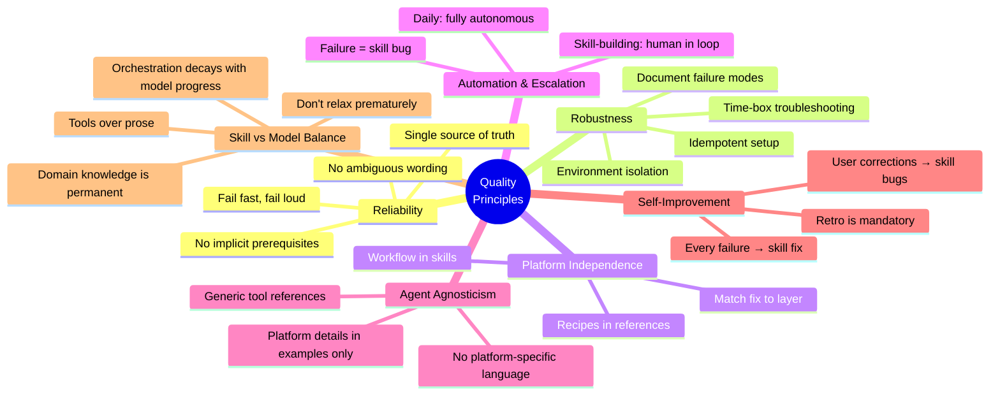
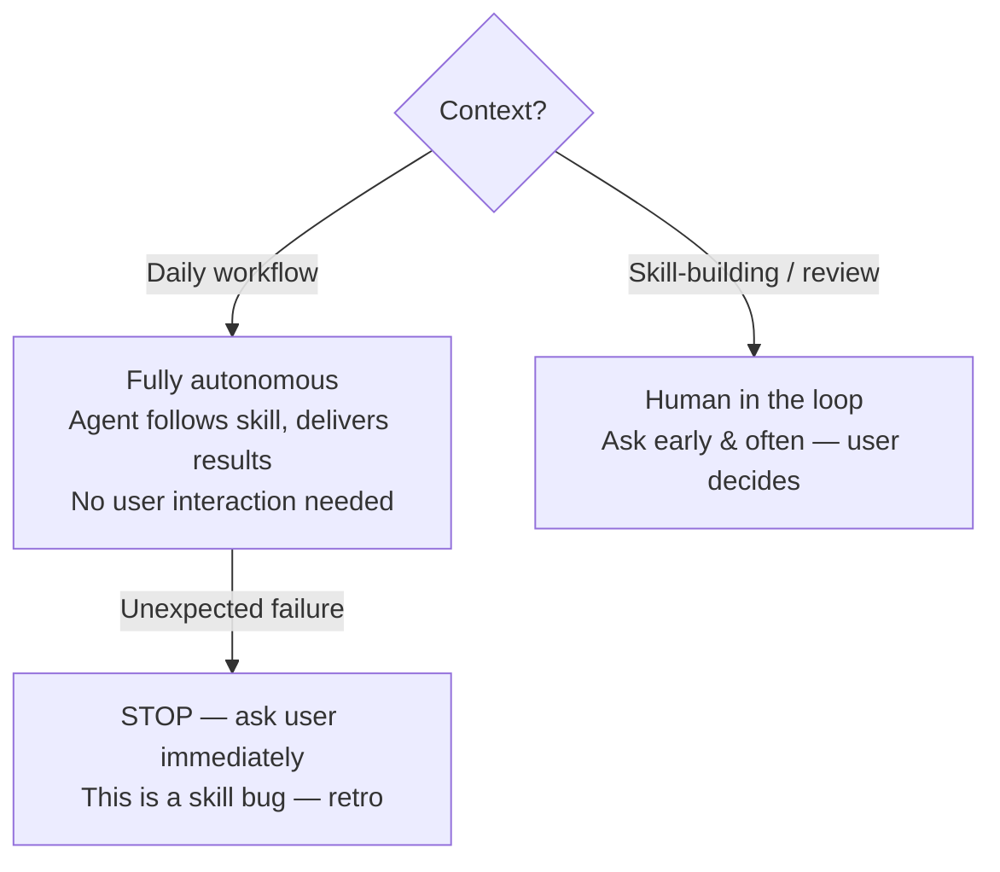

# Quality Principles

These principles apply to all skill reviews. Every skill must be evaluated against them.



## Reliability

Skills must produce **deterministic, repeatable outcomes**. If following a skill's instructions can lead to different results depending on undocumented state, the skill is broken.

- **No implicit prerequisites.** Every dependency must be explicitly listed. "It works if you already ran X" is a bug.
- **No ambiguous wording.** Use "required", "must", "non-negotiable" for things that matter. "Suggested" and "recommended" get ignored.
- **Fail fast, fail loud.** Detect missing prerequisites early with clear messages — don't silently produce wrong results.
- **Single source of truth.** Every piece of operational knowledge lives in exactly one place. Duplicated rules **always diverge over time**. Fix: one canonical location, cross-references from consumers. During review, grep for distinctive phrases across files — if the same concept appears in 2+ places, consolidate.

## Robustness

Skills must handle real-world conditions, not just the happy path.

- **Document failure modes.** For every workflow, ask: "What goes wrong?" Common failures must have documented recovery steps.
- **Time-box troubleshooting.** "If X doesn't work after 2 minutes, stop and do Y" prevents spiraling.
- **Environment isolation.** Pair every "never mix A with B" rule with "here's how to verify you're in the right environment".
- **Idempotent setup.** Running setup twice = same result as once. If not, document the cleanup step.

## Platform Independence

Separate **what to do** (workflow logic) from **how to do it on a specific platform** (API recipes, CLI commands).

- **Workflow stays in the skill** — platform-neutral steps, decisions, rules, and ordering.
- **Platform recipes go in reference files** — API commands, auth patterns, URL formats, MCP tool names.
- **Match the fix to the layer.** Prose coupling → extract to reference files. Don't build Python abstractions for content the agent reads as text.
- **Don't over-abstract.** One reference file per platform that exists today. No empty placeholders.
- **Detect coupling during review.** Grep for: API URLs, tokens, platform-specific CLI/MCP tool names, platform concepts (labels, draft notes). >10 lines of platform-specific commands inline = coupled.
- **Verify after extraction.** The skill body should read as "do X, do Y, verify Z" without platform knowledge.

## Automation & Escalation



**Review for both modes:** (1) Can the agent complete the workflow end-to-end without asking? If not, the skill has gaps. (2) Does the skill tell the agent to escalate quickly on failure? No time-box = hours of wasted effort.

## Agent Agnosticism

Skills should work with **any agent platform**, not just the one the author uses.

- **No platform-specific language in skill bodies.** Don't say "use the image-reading tool" or "use the shell tool" — say "read the file" or "run the command". The agent knows its own tools.
- **Generic tool references.** Instead of naming a specific tool, describe the action: "ask the user". If a platform example helps, keep it in a separate platform-specific reference rather than the main rule.
- **Platform details in examples, not rules.** Rules must be universal: "ask the user for confirmation". Examples can show platform-specific invocations.
- **Config file references.** Don't hardcode agent-specific filenames or home-directory paths — use generic terms like "the agent's personal config file" with platform examples in a dedicated reference when needed.
- **Exception: platform integration skills.** Skills whose entire purpose is platform setup (e.g., a setup wizard for a specific agent) may reference that platform freely. But lifecycle and domain skills must stay generic.
- **Detection during review.** Grep for platform-specific terms such as agent brand names, agent-home paths, agent config filenames, and explicit tool names. Each hit in a non-platform skill must be justified or generalized. **Ask the user if a reference should stay or be generalized** — some platform-specific mentions are intentional (e.g., documenting actual file paths in a setup guide).

## Self-Improvement

- **Every failure is a skill bug.** Missing knowledge goes into the skill — not chat history. Knowledge that stays in a conversation dies with the context window.
- **Retro is mandatory.** Skills should reference the retro skill in their "after completion" steps.
- **Measure skill coverage.** "Could an agent complete this workflow using only the skills?" If not, fill the gaps.
- **User corrections are skill bugs.** Trace back to a skill deficiency and fix. Same mistake must never happen twice.
- **Hook and loading reliability.** Verify loading mechanisms work with sample prompts. If keyword-based, verify keywords cover real-world phrasing.

## Skill vs Model Balance

Skills exist to encode knowledge the model lacks. As models improve, the boundary shifts — but not uniformly. The reviewer must distinguish what is permanently valuable from what compensates for temporary model limitations, and resist both over-engineering and premature simplification.

- **Domain knowledge is permanent.** Project infrastructure (repo layout, credentials, CLI tool pitfalls, migration ordering, environment isolation rules), team conventions, and integration-specific sequences will never appear in training data. Skills encoding this knowledge are irreplaceable regardless of model capability. A brilliant new hire would need the same information.
- **Orchestration scaffolding decays.** Step-by-step workflow ordering, troubleshooting decision trees, and verification checklists compensate for the model's current inability to figure these out alone. Each model generation reduces the need — but **never assume the current model has caught up.** Only relax orchestration after observing the model consistently succeeding without it.
- **Script vs prose: find the sweet spot.** Scripts are more reliable than prose — but they cost maintenance. Every script is code you own: it needs tests, version bumps, bug fixes when dependencies change. Prose costs nothing to maintain but the model may misinterpret it. The reviewer must evaluate each procedure and decide which side of the line it falls on.

  **Use a script when:**
  - The procedure is **deterministic and exact** — specific CLI flags, precise file paths, arithmetic, binary manipulation. The model will get creative where you need it to be literal.
  - The procedure **has failed before** when the model interpreted it from prose. One failure = strong signal.
  - The procedure involves **tool-specific quirks** the model doesn't know (undocumented flags, version-specific behavior, workarounds for bugs in third-party tools).
  - The output must be **bit-for-bit reproducible** (checksums, PDF geometry, config file generation).

  **Use prose when:**
  - The procedure requires **judgment** — choosing between approaches, adapting to context, deciding what to skip. Scripts can't reason; models can.
  - The steps are **simple and well-known** — running standard CLI commands, creating files, making API calls. The model does these reliably without scripts.
  - The domain is **well-represented in training data** — standard frameworks, popular tools, common patterns. The model already knows how; it just needs to know *when* and *what*.
  - The procedure **changes often** — if the steps shift every few weeks, a script becomes a maintenance burden faster than prose does.

  **Decision flowchart:**

  ```mermaid
  flowchart TD
      A["Inline procedure<br/>in skill"] --> B{"Has the model<br/>failed this before?"}
      B -->|Yes| S["**Script**<br/>Model proved unreliable"]
      B -->|No| C{"Deterministic +<br/>exact output?"}
      C -->|Yes| D{"Changes often?"}
      D -->|No| S
      D -->|Yes| P["**Prose**<br/>Maintenance cost > reliability gain"]
      C -->|No| E{"Requires judgment<br/>or adaptation?"}
      E -->|Yes| P
      E -->|No| F{"Well-known<br/>domain?"}
      F -->|Yes| P
      F -->|No| S

      style S fill:#e8f8e8,stroke:#2d9a4e
      style P fill:#e8f4f8,stroke:#2d7d9a
  ```

  **During review:** For every inline multi-step procedure (3+ steps), run through this flowchart. Flag script candidates and prose candidates explicitly in the change plan. **Always ask the user** before converting — they know the maintenance cost better than the reviewer.

- **Don't give context upfront — give tools to fetch it.** A 200-line skill loaded into context wastes tokens on sections irrelevant to the current task. Prefer a slim main file (goals, rules, available tools) with detailed references the model pulls when needed. The existing pattern of `SKILL.md` + `references/` is the right structure — during review, check that the split is effective and main files aren't bloated.
- **Don't relax guardrails prematurely.** The model confidently uses outdated CLI syntax, skips verification steps, and spirals on complex multi-tool setups. These are observed, current failures — not theoretical risks. The § 2.8 classification (domain vs model-limitation) provides the framework: domain guardrails are permanent, model-limitation guardrails are reviewed only when a new model generation ships and only after testing.
- **Watch for productive deviations.** When the model deviates from a skill's instructions and the result is correct, that's signal — the skill may be over-constraining. But in practice, most deviations in complex domain workflows (multi-repo setup, E2E testing, CI interaction) are errors, not insights. **Default to treating deviations as failures** and only reclassify after repeated evidence.
- **Watch for counterproductive guidance.** User-written instructions, helper scripts, and workflow prescriptions sometimes **reduce the agent's effectiveness** by narrowing its approach to one rigid path. During review, evaluate each piece of explicit guidance: "Does this help the agent succeed, or does it constrain the agent into a less efficient approach than it would find on its own?" If the guidance appears counterproductive, **do not delete it** — it may exist for a reason the reviewer doesn't see. Instead, flag it as a question for the user: "This instruction appears to constrain the agent — is it still needed, or was it a workaround for an older model's limitations?" As models improve, previously necessary hand-holding becomes unnecessary scaffolding.
- **The Bitter Lesson has limits.** In general AI, more general models outperform specialized scaffolding over time. But skills aren't competing with the model — they provide knowledge the model structurally cannot have (private infrastructure, unpublished tool quirks, team-specific conventions). The lesson applies to *how* the model executes (don't micro-manage its reasoning), not to *what* it knows (always provide domain context).
